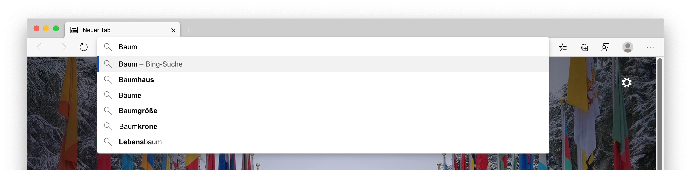
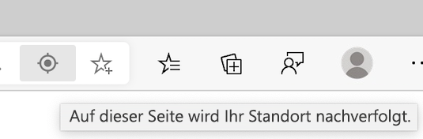
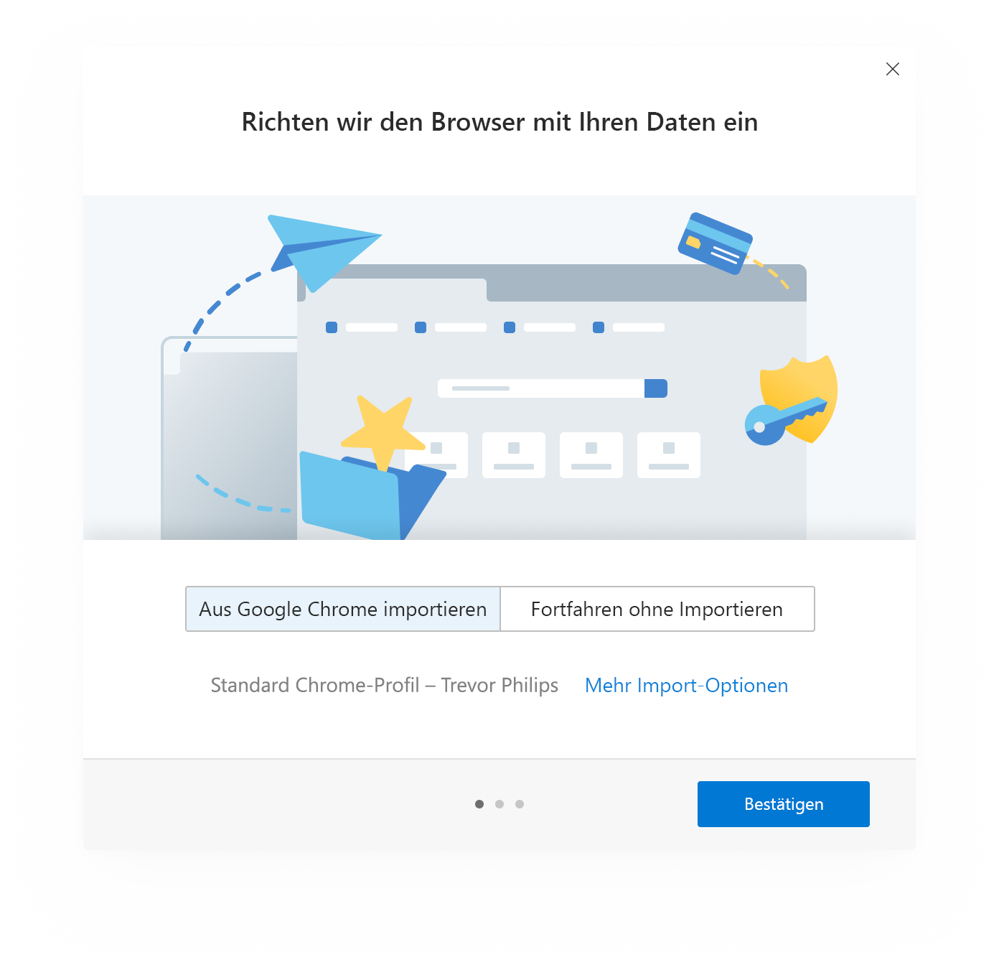
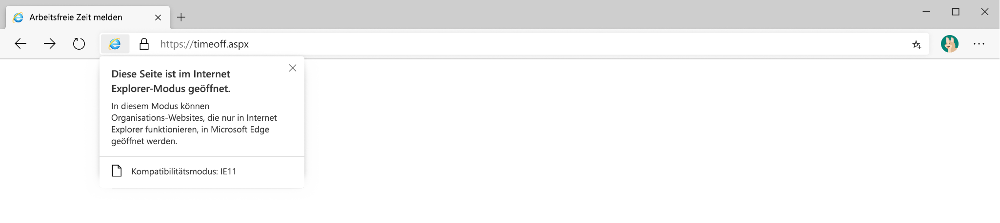
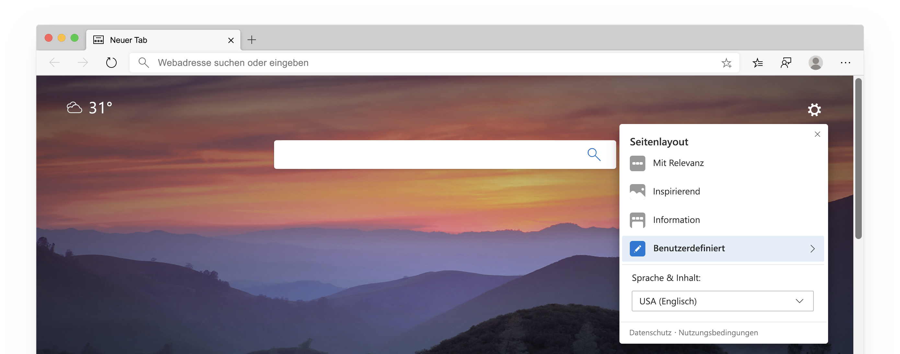
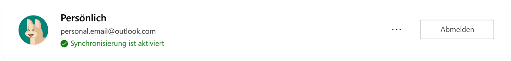
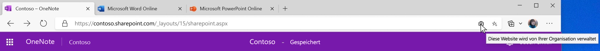

# Whitepaper zum Microsoft Edge-Datenschutz  

Unser Browser-Datenschutz Versprechen ist es, Ihnen den Schutz, die Transparenz, die Kontrolle und den Respekt zu verschaffen, den Sie verdienen.  Um Zusagen einzuhalten, um Ihnen Transparenz in Microsoft-Produkten zu geben, hat das Microsoft Edge-Team ein Whitepaper zur Datensicherheit bereitgestellt, in dem erläutert wird, wie die Microsoft Edge-Features und-Dienste funktionieren und wie sich diese auf den Datenschutz  Das Ziel des Microsoft Edge-Teams besteht darin, Ihnen ein umfassendes Verständnis darüber zu vermitteln, wie Ihre Daten verwendet werden, wie Sie die verschiedenen Features steuern und wie Sie Ihre gesammelten Daten verwalten, damit Sie über die Informationen verfügen, die Sie benötigen, um die richtigen datenschutzentscheidungen für Sie zu treffen.  

In bestimmten Abschnitten des Papiers stellt das Microsoft-Team Schritte bereit, um zu den Microsoft Edge-Einstellungen und anderen Seiten zu wechseln.  Aus Gründen der Konsistenz hat das Microsoft Edge-Team im gesamten Whitepaper ein verkürztes Format verwendet: Es sollten URLs angezeigt werden, die mit wie `edge://` `edge://favorites` oder beginnen `edge://settings/privacy` .  Um zu den Seiten zu wechseln, geben Sie den fett formatierten Text direkt in die Microsoft Edge-Adressleiste ein.  Diese Seiten können nur in Microsoft Edge angezeigt werden.  

Das Whitepaper konzentriert sich auf die Desktop Version von Microsoft Edge, und Teile des Papiers können Features oder Erfahrungen enthalten, die nicht für alle Benutzer verfügbar sind.  Darüber hinaus erörtert das Whitepaper Features und Dienste, die im Produkt heute vorhanden sind, aber möglicherweise in der Zukunft geändert werden.  Microsoft Practices-Daten Sammlungs Minimierung, was bedeutet, dass Ihre Daten für die minimale Zeitdauer aufbewahrt werden, aber die Aufbewahrungszeiten können je nach verwendetem Feature oder Dienst variieren und sich im Laufe der Zeit ändern.  

## Adressleiste und Vorschläge  

Über die Adressleiste können Sie Website-URLs eingeben und im Web suchen.  Standardmäßig werden in der Adressleiste Such-und Website Vorschläge unter Verwendung der von Ihnen eingegebenen Zeichen bereitgestellt.  Es sollten Vorschläge aus Ihren Favoriten, dem Browserverlauf, vorherigen Suchvorgängen und dem Standardsuchanbieter angezeigt werden.  

  

Damit Sie während der Eingabe in der Adressleiste schneller Browsen und suchen können, werden die typisierten Zeichen an Ihren Standardsuchanbieter für den Suchanbieter gesendet, um vorgeschlagene Suchabfragen zurückzusenden.  Die Adressleiste kategorisiert Ihren Eintrag als URL, suchen oder unbekannt.  Die Informationen, zusammen mit dem von Ihnen ausgewählten Vorschlag, der Auswahlposition und anderen Adressleisten Daten werden an Ihren Standardsuchanbieter gesendet.  Wenn es sich bei Ihrem Suchanbieter um Bing handelt, wird ein für Ihren Browser eindeutiger rücksetzbarer Bezeichner mit den Daten gesendet, um die Suchabfrage-und Abfragesitzung zu verstehen.  Andere Autosuggestion-Dienst Kennungen werden an Ihre Standardsuchmaschine gesendet, um die Suchvorschläge abzuschließen.  Ihre IP-Adresse und Cookies werden an Ihren Standardsuchanbieter gesendet, um die Relevanz der Suchergebnisse zu erhöhen.  Wenn Sie die Adressleiste auswählen, wird ein Signal an Ihren Standardsuchanbieter gesendet, um dem Anbieter zu signalisieren, dass Sie bereit sind, Vorschläge zu machen.  Die typisierten Zeichen und Suchabfragen werden nicht an Microsoft gesendet, es sei denn, der Suchanbieter ist Bing.  Diese Daten werden nur an den standardmäßigen Suchanbieter gesendet, wenn Sie über die Einstellung "meine eingegebenen **Zeichen anzeigen" und "Website Vorschläge verwenden** " verfügen.  Wenn Sie das Feature deaktivieren, wird verhindert, dass Ihre typisierten Zeichen an den Standardsuchanbieter gesendet werden.  Ihre Suchabfragen werden weiterhin an Ihren Standardsuchanbieter gesendet, um Suchergebnisse bereitzustellen.  Wenn Microsoft Edge erkennt, dass Ihre Eingabe in der Adressleiste vertrauliche Informationen wie Authentifizierungsanmeldeinformationen, lokale Dateinamen oder URL-Daten enthalten kann, die normalerweise verschlüsselt sind, wird der eingegebene Text nicht gesendet.  Wenn Sie **Microsoft-Produkte verbessert haben, indem Sie Absturzberichte und Daten darüber senden, wie Sie die Browser** Einstellung aktiviert haben, sammelt Microsoft Edge Diagnosedaten zur Adressleiste, beispielsweise wie viele Abfragen angeboten wurden, unabhängig von Ihrem Suchanbieter.  

Tastenanschläge und die von Ihnen besuchten Websites werden lokal auf dem Gerät pro Profil gespeichert.  Sie können die Daten löschen `edge://settings/clearBrowserData` , indem Sie das Kontrollkästchen für den **Browserverlauf**aktivieren und **dann jetzt**löschen auswählen.  Wenn Bing Ihr Standardsuchanbieter ist und Sie bei Bing angemeldet sind, können Sie Ihre Suchvorgänge über das [Microsoft-Datenschutz-Dashboard](https://account.microsoft.com/account/privacy?ref=privacy-edge-browse&ru=https%3A%2F%2Faccount.microsoft.com%2Fprivacy%2Fbrowse%3Fref%3Dprivacy-edge-browse&destrt=privacy-dashboard)löschen.  Sie können Ihren Browserverlauf löschen `edge://history` , um diese Websites als Vorschläge in der Adressleiste anzuzeigen.  Unter Windows 10 können Sie die Daten, die Microsoft in der Adressleiste sammelt, und die Suchvorschlags Funktionen löschen, indem Sie zu **Start**  >  **Einstellungen**  >  **Datenschutz**  >  **Diagnose \ & Feedback**und dann unter **Diagnosedaten löschen**die Option **Löschen** auswählen.  Alle anderen Daten werden nach 36 Monaten gelöscht.  

Wenn Sie bei Microsoft Edge mit einem Microsoft-Geschäfts-oder Schulkonto angemeldet sind und Microsoft Search zur Verfügung steht, wird ein anonymes Token, das Ihr Konto darstellt, mit der Abfrage gesendet, um kontospezifische Funktionen wie unternehmensspezifische Ergebnisse zur Verfügung zu stellen.  

Alle Daten werden sicher über HTTPS übertragen.  Wenn [Bing](https://bing.com) Ihr Standardsuchanbieter ist, werden die Zeichen suchen und Typen für bis zu 6 Monate gespeichert.  

Wenn Sie im Feld Adresse nach einem einzelnen Wort suchen, sendet Microsoft Edge möglicherweise das einzelne Wort an Ihren DNS-Server, um festzustellen, ob es einem Host in Ihrem Netzwerk entspricht, und versuchen Sie möglicherweise, eine Verbindung mit dem entsprechenden Host herzustellen.  Damit haben Sie die Möglichkeit, zu diesem Host zu navigieren, anstatt zu suchen.  Wenn der Router beispielsweisedurch den Hostnamen wechselt `router` und Sie `router` in die Adressleiste eingeben, haben Sie die Möglichkeit, zu navigieren und nach `https://router/` dem Wort `router` mit dem Standardsuchanbieter zu suchen.  Dieses Feature wird nicht von den **Such-und Website Vorschlägen unter Verwendung meiner** eingegebenen Zeichen gesteuert, da keine Daten an die Standardsuchmaschine gesendet werden müssen.  

Sie können die **Such-und Website Vorschläge unter "meine typisierten Zeichen** " deaktivieren und ihre Standardsuchmaschine in ändern `edge://settings/search` .  Beim Durchsuchen von InPrivate oder im Gastmodus sind autosuggestions deaktiviert.  InPrivate zeigt Vorschläge aus dem lokalen Browsing an, wie etwa das Durchsuchen des Verlaufs oder frühere Suchvorgänge, aber es werden keine typisierten Zeichen an Ihre Standardsuchmaschine gesendet.  Im Gastmodus werden keine Vorschläge angezeigt, oder Sie können keine typisierten Zeichen an Ihre Standardsuchmaschine senden.  

Von anderen Suchanbietern gesammelte Daten folgen den Datenschutzrichtlinien des Unternehmens.  

## AutoAusfüllen  

Durch automatisches Ausfüllen in Microsoft Edge können Sie Ihre Produktivität steigern, indem Sie Kennwörter, Zahlungsinformationen, Adressen und andere Formular Eintragsdaten speichern.  Wenn Sie eine Website besuchen und mit dem Ausfüllen eines Formulars beginnen, verwendet Microsoft Edge Formular Füll Informationen, um die gespeicherten AutoFill-Daten dem Formular zuzuordnen.  Microsoft Edge bietet Formular Eintragsdaten, die Sie zuvor gespeichert haben, wenn Sie auf ähnliche Formulare stoßen.  Kennwörter und Kreditkarteninformationen werden nur mit Ihrer ausdrücklichen Genehmigung für jedes Kennwort und jede Karte gespeichert.  

Adressen und andere Formulareinträge werden standardmäßig gespeichert.  Sie können jedoch das Speichern und automatisches Ausfüllen von Adressen und anderen Formulardaten in deaktivieren `edge://settings/addresses` .  

Verhindern Sie, dass Microsoft Edge Sie auffordert, Kennwörter zu speichern, indem Sie die Einstellung **zum Speichern von Kennwörtern** in deaktivieren `edge://settings/passwords` .  Wenn Sie nicht möchten, dass Microsoft Edge vorhandene gespeicherte Kennwörter automatisch ausgibt, können Sie die gespeicherten Kennwörter löschen, `edge://settings/passwords` um alle AutoFill-Daten zu löschen, und dann in den Microsoft Edge-Datenschutz-und-Dienstleistungs Einstellungen auf die Einstellung **Daten durchsuchen** .  Wählen Sie **AutoFill-Formulardaten**, den gewünschten Zeitbereich und dann **jetzt löschen**aus.  

Wenn Sie die Synchronisierung für Ihr Profil aktiviert haben, werden Ihre AutoFill-Daten in allen Versionen von Microsoft Edge synchronisiert, in denen Sie mit den gleichen Anmeldeinformationen angemeldet sind.  Wenn die Synchronisierung aktiviert ist, werden alle AutoFill-Daten auf verschlüsselten Microsoft-Servern gespeichert.  Die auf Microsoft-Servern gespeicherten AutoFill-Daten werden nur für Synchronisierungs Zwecke verwendet.  Sie können die Synchronisierung Ihrer AutoFill-Daten in deaktivieren `edge://settings/profiles/sync` .  Wenn Sie die Synchronisierung für Autofill aktiviert haben, werden die AutoFill-Daten von anderen Geräten, auf denen Sie angemeldet sind, gelöscht, wenn Sie AutoFill-Daten von einem Gerät löschen, auf dem Sie bei Microsoft Edge angemeldet sind.  

Wenn Sie eine Webseite besuchen und ein Formular übermitteln, sendet Microsoft Edge Informationen zu dem Formular, beispielsweise einen Hash des Typs Hostname und AutoAusfüllen-Eintrag \ (Beispiel: Feld 1 sucht nach einer e-Mail-Adresse, Feld 2 sucht nach einem Kennwort usw.) zum Microsoft-Formular Füll Dienst.  Es werden keine vom Benutzer eingegebenen Informationen oder Benutzer-IDs an den Dienst gesendet.  Diese Informationen helfen Microsoft Edge, Formulare auf verschiedenen Webseiten richtig zu erkennen.  Diese Daten werden verwendet, um die Übereinstimmung der gespeicherten AutoFill-Daten mit dem Formular zu ermöglichen.  

Wenn Sie den Gastmodus verwenden, ist AutoFill nicht verfügbar, und es werden keine neuen AutoFill-Einträge hinzugefügt.  Wenn Sie InPrivate durchsuchen, bietet Microsoft Edge AutoFill-Einträge, es werden jedoch keine neuen AutoFill-Einträge hinzugefügt.  

## Cast  

Cast in Microsoft Edge ermöglicht Ihnen, Ihre Medien auf einem anderen Bildschirm mit Google Cast anzuzeigen.  Sie können auf das Feature über **Einstellungen und mehr (...)**  >  zugreifen. **Weitere Tools**  >  **Medien in Gerät umwandeln**  Cast verwendet keine Microsoft-oder Google-Dienste. 

## Sammlungen  

Sie können Websites, Text und Bilder im Web sammeln und die Inhalte mit Sammlungen in Microsoft Edge organisieren.  Alle Sammlungsdaten werden lokal auf dem Gerät gespeichert und pro Microsoft Edge-Profil organisiert.  Wenn die Synchronisierung für Auflistungen aktiviert ist, sind Ihre Sammlungen, einschließlich aller Notizen oder Kommentare, in allen angemeldeten und synchronisierten Versionen von Microsoft Edge verfügbar.  

Alle 24 Stunden Microsoft Edge downloadet eine Liste unterstützter Websites, für die spezielle Entitäts extraktionsvorlagen vorhanden sind.  Die Vorlagen sind für jede Website spezifisch.  Wenn Sie ein neues Element in Ihrer Sammlung erstellen, überprüft Microsoft Edge, ob sich die Website, von der aus Sie das neue Sammlungselement erstellen, in der Liste der unterstützten Websites befindet.  Wenn sich die Website in der Liste befindet, pingt Microsoft Edge den Entitäts Extraktions Dienst für die jeweilige Websites Vorlage an.  Der Anforderung des Diensts sind keine Benutzer-IDs zugeordnet.  Mit dieser Vorlage wird versucht, den Namen, den Preis, die Bewertungen, das primäre Bild und andere Daten über das gesammelte Element zu identifizieren.  Wenn sich die Website, von der Sie ein neues Sammlungselement erstellen, nicht auf der unterstützten Listen Website befindet, lädt Microsoft Edge keine Vorlage herunter.  Mit den Vorlagen können alle Sammlungselemente lokal auf dem Gerät erstellt werden.  Es werden keine Daten über die Sammlungselemente an den Dienst gesendet, um die Sammlung zu erstellen.  

Die auf dem Gerät gespeicherten Vorlagen werden möglicherweise gelöscht, indem die Cachedaten unter der Einstellung **Browserdaten löschen** in deaktiviert werden `edge://settings/privacy` .

<!--  
If you turn on **Show suggestions from Pinterest in Collections**, Collections perform a Microsoft Bing search using the title of your collection to find relevant Pinterest Topic pages.  Microsoft Edge does not send data about your collections to Pinterest.  You may remove the suggestions and stop searches for Pinterest Topic pages by going to `edge://settings/privacy` and turning off **Show suggestions from Pinterest in Collections**.  
-->  

Auflistungen steht nicht zur Verfügung, wenn Sie den InPrivate-Browser oder Gastmodus verwenden.  

## Stürzt  

Wenn optionale Diagnosedaten einschließlich Absturzberichte aktiviert sind, sammelt Microsoft Diagnosedaten, wenn Microsoft Edge abstürzt oder auf andere Zuverlässigkeitsprobleme stößt.  Diese Diagnosedaten werden verwendet, um die Zuverlässigkeitsprobleme von Microsoft Edge und anderen Microsoft-Produkten und-Diensten zu diagnostizieren und zu beheben.  

  

Die erfassten diagnostischen Daten sind in Form von Absturzabbildern, die den Geräte-und Softwarezustand enthalten, der zum Zeitpunkt des Auftretens des Zuverlässigkeits Problems durch Microsoft Edge erfasst wurde.  Der Absturz Speicherauszug enthält Informationen dazu, was zum Zeitpunkt des Zuverlässigkeits Problems geschah.  Informationen wie die Website, die Sie zum Zeitpunkt des Absturzes besucht haben, oder die CPU-Nutzung sind möglicherweise in den Diagnosedaten enthalten.  Die Absturz Diagnosedaten werden lokal auf dem Gerät gespeichert und über einen verschlüsselten Link an Microsoft gesendet, wenn Absturzberichte aktiviert sind.  Jeder Absturz Speicherauszug enthält einen eindeutigen Bezeichner für Ihr Gerät, einen für Ihren Browser eindeutigen, für Ihren Browser eindeutigen und zusätzliche Diagnosedaten (wie URL, CPU-Auslastung und Netzwerkauslastung \), um das Problem zu erkennen.  Diese zusätzlichen Diagnosedaten sind an das Absturzspeicherabbild angefügt, um das Zuverlässigkeitsproblem zu diagnostizieren, wie beispielsweise das Verständnis, wie viele Geräte auf das Problem und den Schweregrad stoßen.  

Absturzabbilder werden an Microsoft gesendet und bis zu 30 Tage lang auf sicheren Microsoft-Servern gespeichert und dann gelöscht.  Anfordern, um die Diagnosedaten auf Windows 10-Geräten zu löschen, indem Sie zu **Start**  >  **Einstellungen**  >  **Datenschutz**  >  **Diagnose \ & Feedback** und Auswahl von " **Löschen** " unter der Einstellung " **Diagnosedaten löschen** " auswählen.  Zusammengefasste Absturzinformationen, wie die Anzahl der auftretenden Absturz Typen, werden zur Berichterstellung und zum Zwecke der Produktverbesserung gespeichert.  

Absturz Diagnosedaten, die lokal auf dem Gerät gespeichert sind, werden möglicherweise aus dem Dateisystem in gelöscht `edge://crashes` .  

Wenn Sie die Sammlung der Absturz diagnostischen Daten unter Windows 10 deaktivieren möchten, wechseln Sie zu **Diagnose \ & Feedback** in Windows Diagnostics \ & Feedback Einstellungen.  Für Versionen von Microsoft Edge auf allen anderen Plattformen wechseln Sie zu `edge://settings/privacy` und deaktivieren Sie die Option **Microsoft-Produkte verbessern, indem Sie Absturzberichte und Daten zur Verwendung der Browsereinstellung senden** .  Diese diagnostische Datensammlung kann auch für Unternehmen über [von Ihrer Organisation verwaltete Gruppenrichtlinien](/deployedge/microsoft-edge-privacy-policy)deaktiviert werden.  

## Diagnosedaten zur Verwendung des Browsers  

Microsoft verwendet Diagnosedaten, um Microsoft-Produkte und-Dienste zu verbessern, Microsoft-Produkte sicher und auf dem neuesten Stand zu halten und zu einem besseren Verständnis der Leistungsfähigkeit von Microsoft-Produkten beizutragen.Wenn das Microsoft Edge-Team Daten sammelt, wird die Entscheidung als die richtige Wahl für Sie überprüft.  Microsoft glaubt an und übt eine Minimierung der Informationssammlung aus.  Das Microsoft Edge-Team ist bestrebt, nur die erforderlichen Informationen zu sammeln, und es wird nur so lange gespeichert, wie es erforderlich ist, um Microsoft-Produkte und-Dienste zu verbessern.  

Während Sie Features und Dienste in Microsoft Edge und anderen Anwendungen verwenden, die die Microsoft Edge Web Platform verwenden, werden Diagnosedaten zur Verwendung dieser Features an Microsoft gesendet.  Zu diesen Diagnosedaten gehören Informationen wie die Installation von Microsoft Edge, die Verwendung von Features, die Leistung und die Speichernutzung.  Wenn Sie beispielsweise eine Website als Favorit festlegen, erhält das Microsoft Edge-Team Informationen darüber, dass auf die Schaltfläche "Favoriten" geklickt wurde und ein Favorit erfolgreich hinzugefügt wurde, aber nicht, welche Website als Favorit festgelegt wurde.  Zu diesen Diagnosedaten gehören auch Leistungsinformationen, wie etwa die Anzahl der Millisekunden, die zum Öffnen einer neuen Registerkarte dauerte.  Die im Whitepaper erwähnten Features und Dienste sammeln Diagnosedaten.  

  

Darüber hinaus sammelt Microsoft Edge eine Reihe erforderlicher Diagnosedaten, die erforderlich sind, um das Produkt auf dem neuesten Stand zu halten, sicherzustellen und ordnungsgemäß zu funktionieren.  Dazu gehören Gerätekonnektivität und Konfigurationsinformationen über die aktuelle Zustimmungs Einstellung für Datensammlungen, die App-Version und den Installationszustand.  Sie können die Einstellung nur mithilfe von Gruppenrichtlinien deaktivieren, die von Ihrer Organisation verwaltet werden.  [Weitere Informationen zu Diagnosedaten in Ihrer Organisation](/windows/privacy/configure-windows-diagnostic-data-in-your-organization).  

Microsoft Edge generiert die Diagnosedaten, speichert Sie lokal und sendet Sie in regelmäßigen Abständen an Microsoft.  Die Diagnosedaten werden über HTTPS gesendet und auf Microsoft-Servern gespeichert.  Diese diagnostischen Daten sind mit einem eindeutigen Bezeichner für Ihr Gerät und einem für Ihren Browser eindeutigen stellen Bezeichner verknüpft.  Die Identifikatoren enthalten nicht Ihre personenbezogenen Informationen.  Wenn Sie den eindeutigen Bezeichner Ihres Browsers auf Windows 10-Geräten zurücksetzen möchten, wechseln Sie zu **Start**  >  **Einstellungen**  >  **Datenschutz**  >  **Diagnose \ & Feedback** , und wählen Sie unter der Einstellung **Diagnosedaten löschen** die Option **Löschen** aus, oder ändern Sie die Einstellung unter **Diagnosedaten** von **vollständig** in **Standard**.  Auf anderen Plattformen wird die für Ihren Browser eindeutige RÜCKSETZBARE ID wieder generiert, wenn Sie die **Microsoft-Produkte verbessern, indem Sie Daten darüber senden, wie Sie die Browser** Einstellung `edge://settings/privacy` von **ein** **auf aus**verwenden.  Diese Zurücksetzungsfunktion kann für Geräte unterschiedlich sein, die mit von Ihrer Organisation gesetzten Gruppenrichtlinien verwaltet werden.  

Wenn Sie die Windows 10-Version 1803 \ (April 2018 Update \) oder höher verwenden, können Sie die für Microsoft freigegebenen Produktdaten im Diagnosedaten-Viewer anzeigen, indem Sie zu **Start**  >  **Einstellungen**  >  **Datenschutz**  >  **Diagnose \ & Feedback** und dann unter der Einstellung **Diagnosedaten anzeigen** die Option Diagnosedaten Anzeige **Öffnen** auswählen.  

Für andere Plattformen oder Versionen von Windows 10 niedriger als Version 1803, wechseln Sie zu, `edge://data-viewer` um die Diagnosedaten anzuzeigen.  Daten werden regelmäßig an Microsoft gesendet, und `edge://data-viewer` es werden nur Daten angezeigt, die seit dem letzten Öffnen des Viewers an Microsoft gesendet wurden.  Möglicherweise müssen Sie den Viewer aktualisieren, um zu sehen, welche Daten für die angegebene Sitzung an Microsoft gesendet wurden.  Die zum Füllen verwendeten Daten werden `edge://data-viewer` lokal auf dem Gerät gespeichert.  Um die Daten im Viewer zu löschen, schließen Sie einfach die `edge://data-viewer` Registerkarte.  

Die Diagnosedaten werden bis zu 18 Monate auf Microsoft-Servern gespeichert.  Unter Windows 10 können Sie die Diagnosedaten löschen, indem Sie zu **Start**  >  **Einstellungen**  >  **Datenschutz**  >  **Diagnose \ & Feedback** und dann **Löschen** unter der Einstellung **Diagnosedaten löschen** auswählen.  Die Funktion zum Löschen von Diagnosedaten wird nur unter Windows 10, April 2018 Update und neuer unterstützt.  Weitere Informationen finden Sie unter [Diagnose, Feedback und Datenschutz in Windows 10](https://support.microsoft.com/help/4468236/diagnostics-feedback-and-privacy-in-windows-10-microsoft-privacy).  

Für Microsoft Edge unter Windows 10 wird die Einstellung durch Ihre Windows-Diagnosedaten Einstellung bestimmt.  Dies wird in den Microsoft Edge-Datenschutz-und-Diensteinstellungen widergespiegelt.  Ändern Sie die Windows-Einstellungen, indem Sie zu **Start**  >  **Einstellungen**  >  **Datenschutz**  >  **Diagnose \ & Feedback**wechseln.  Auf allen anderen Kanälen und Plattformen können Sie die Sammlung von diagnostischen Daten steuern `edge://settings/privacy` und die **Verbesserungen von Microsoft-Produkten aktivieren oder deaktivieren, indem Sie Absturzberichte und Daten darüber senden, wie Sie die Browsereinstellung verwenden** .  Diese Einstellung ist für alle Profile identisch, die mit der Installation von Microsoft Edge auf Ihrem Gerät verknüpft sind.  Diese Einstellung wird nicht geräteübergreifend synchronisiert.  Die Einstellung gilt für InPrivate-Browsing und den Gastmodus.  Wenn Ihr Gerät mithilfe von Gruppenrichtlinien verwaltet wird, die von Ihrer Organisation eingerichtet wurden, wird es in berücksichtigt `edge://settings/privacy` .  

## Verwaltung digitaler Rechte und Medien Lizenzen  

Wenn eine Website Medieninhalte anbietet, die durch Digital Rights Management (DRM \) geschützt sind, verwendet Microsoft Edge eine sichere Wiedergabe Pipeline, um sicherzustellen, dass der Inhalt nicht unsachgemäß kopiert oder darauf zugegriffen wird.  Als Teil des Features speichert Microsoft Edge möglicherweise DRM-bezogene Daten auf Ihrem Gerät, einschließlich einer eindeutigen Kennung und Medien Lizenzen, und kann diese eindeutige Kennung an einen vom Inhaltsanbieter angegebenen Medien Lizenzierungsserver übertragen.  Wenn Sie die Website verwenden, ruft Microsoft Edge die DRM-Informationen ab, um sicherzustellen, dass Sie über die Berechtigung zum Verwenden der Inhalte verfügen.  Diese Daten helfen, den Zugriff auf geschützte Inhalte zu überprüfen und eine nahtlose Mediennutzung zu gewährleisten.  

Microsoft Edge unterstützt DRM mithilfe der verschlüsselten Medienerweiterungen-API \ (EME-API \) für HTML5-Websites.  Die EME-API ermöglicht Websites die Kommunikation mit einem DRM-Anbieter, dem sogenannten Inhalts Entschlüsselungsmodul \ (CDM \).  Verschiedene DRM-Systeme, wie etwa Widevine von Google oder PlayReady von Microsoft, werden möglicherweise von der CDM-Implementierung des Entwicklers unterstützt.  Inhaltsanbieter entscheiden sich möglicherweise für die Unterstützung eines oder mehrerer potenzieller DRM-Systeme und können die Funktionalität der EME-API verwenden, um zu entscheiden, welches DRM-System für einen bestimmten Client verwendet werden soll.  [Weitere Informationen zu eme-Datenschutz](https://w3.org/TR/encrypted-media/#privacy).  

Microsoft Edge unterstützt PlayReady DRM nur unter Windows 10.  PlayReady ist eine DRM-Implementierung, um Medienerlebnisse wie 4K-Video und Dolby Atmos-Audio zu liefern.  Microsoft Edge verwendet die Windows Platform Media Foundation-APIs zur Unterstützung von PlayReady.  Zum Überprüfen des Zugriffs auf geschützte Inhalte nutzt Microsoft Edge das Windows 10-Betriebssystem, das einen eindeutigen Bezeichner verwendet und dieses mit dem PlayReady-Dienst kommuniziert.  Alle eme-, CDM-und Browserdaten für PlayReady, die auf dem Gerät bestehen, werden auf Microsoft Edge gespeichert und verwaltet.  [Weitere Informationen zu PlayReady](/playready/overview/simple-end-to-end-system).  

Microsoft Edge unterstützt Widevine von Google DRM, und die Option ist standardmäßig aktiviert.  Microsoft Edge holt in regelmäßigen Abständen Updates für Widevine von Google-Servern herunter.  Die Nutzung von Widevine kann auch Mitteilungen an Google umfassen.  Benutzer können die Verwendung von Widevine in Microsoft Edge deaktivieren, indem Sie das Widevine-DRM-Flag in deaktivieren `edge://flags/#edge-widevine-drm` .  Widevine hat die Möglichkeit, eine eindeutige Gerätekennung zu erstellen und diese an Google zu übertragen.  Weitere spezifische Informationen zu Widevine und Datenschutz finden Sie in den Google-Datenschutzrichtlinien.  

Microsoft Edge unterstützt Flash Access DRM von Adobe, das von einigen Websites anstelle von HTML5 verwendet wird.  Sie müssen die Berechtigung zum Zulassen von Adobe Flash erteilen, wenn eine Website Sie anfordert.  Wenn eine Website das Flash Access DRM von Adobe verwendet, bietet Microsoft Edge Adobe Access eine eindeutige Gerätekennung.  Sie können alle lokal gespeicherten Instanzen des Bezeichners in löschen und Zurücksetzen `edge://settings/privacy` .  Wählen Sie unter **Browserdaten löschen**die Option **zu**entfernende Elemente auswählen aus, aktivieren Sie das Kontrollkästchen für **Cookies und andere Website Daten**, und wählen Sie **jetzt löschen** aus, um alle gespeicherten IDs zu entfernen.  Verhindern Sie, dass Adobe Flash DRM jemals in verwendet wird `edge://settings/content/flash` .  

Wenn Sie den Zugriff auf verschlüsselte HTML5-Medien wie einen Online-Film anfordern, erstellt Microsoft Edge eine Lizenzanforderung zum Entschlüsseln der Medien.  Der verwendete CDM erstellt die Lizenzanforderung, die eine Anforderungs-ID enthält.  Diese Anforderung wird an den Lizenzserver gesendet.  Kein Teil der Lizenzanfrage enthält personenbezogene Informationen, und die Lizenzanforderung wird nicht auf dem Gerät gespeichert.  

Wenn Sie die Medienlizenz zurückgeben, wird eine Medienkennung erstellt, die für den Benutzer und die Website eindeutig ist.  Diese ID wird nicht zwischen Websites freigegeben und ist für jede Website unterschiedlich.  Eine Sitzungs-ID, die zum Identifizieren einer Wiedergabesitzung verwendet wird, wird mit der Medienkennung gesendet, um die Medien zu entschlüsseln.  Die Medienkennung wird lokal auf dem Gerät gespeichert und kann mit dem Inhaltsanbieter gespeichert werden.  

Alle DRM-und Inhaltsschutz Maßnahmen sind möglicherweise deaktiviert `edge://settings/content/protectedContent` .  

- Wenn Sie die Einstellung **Websites zur Wiedergabe geschützter Inhalte zulassen** deaktivieren, wird die Wiedergabe für CDM-basierte DRM-Systeme wie PlayReady und Widevine deaktiviert, nicht aber für nicht-CDM-basierte Systeme wie Flash Access DRM.  Flash wird von einer separaten Website Berechtigung in verwaltet `edge://settings/content/flash` .  Wenn Sie die Einstellung deaktivieren, werden die Medienfunktionen nicht mehr ordnungsgemäß funktionieren.  
- Wenn Sie die Einstellung **Bezeichner für geschützten Inhalt zulassen** deaktivieren, wird das Erstellen von Bezeichnern für Flash Access-DRM verhindert und verhindert, dass Widevine regelmäßig Updates von Google abruft.  Dies kann dazu führen, dass einige Medienfunktionen auf einigen Websites nicht mehr ordnungsgemäß funktionieren.  

## Nicht nachvollziehen  

Wenn Sie die Einstellung "keine nachverfolgte **Anforderung senden"** aktivieren `edge://settings/privacy` , sendet Microsoft Edge einen DNT: 1-http-Header mit Ihren ausgehenden HTTP-, HTTPS-und SPDY-Datenverkehrsanforderungen an Websites, die Sie besuchen, um anzufordern, dass jeder keine Tracker verwendet.  Wenn Sie jedoch die Einstellung "keine nachverfolgte **Anforderung senden"** aktivieren, kann nicht garantiert werden, dass Websites Sie nicht nachvollziehen können.  Einige Websites können die Anforderung Ehren, indem Sie anzeigen anzeigen, die nicht auf einem vorherigen Browser basieren.  Microsoft Edge hat keine Kontrolle, wenn die Anforderung berücksichtigt wird.  Um zu verhindern, dass Websites Sie nachverfolgen können, ändern Sie die Einstellung zur **nach Verfolgungs Verhinderung** in `edge://settings/privacy` auf **symmetrisch** oder **streng**.  

Wenn Sie den Gastmodus verwenden, sendet Microsoft Edge keine Anforderungen "nicht nachvollziehen".  Wenn Sie das InPrivate-Browsen verwenden, sendet Microsoft Edge nur "keine nachverfolgten" Anforderungen, wenn die Einstellung "keine nachverfolgte **Anforderung"** für das von Ihnen verwendete Profil aktiviert ist.  

## Downloads  

Mit Microsoft Edge können Sie Dateien sicher und sicher herunterladen.  Sie können auswählen, wo Dateien auf Ihrem Gerät heruntergeladen werden sollen `edge://settings/downloads` .  Wenn SmartScreen aktiviert ist, werden Informationen zu Ihrer Datei, beispielsweise der Dateiname und die URL, an den SmartScreen-Dateinamen gesendet, um die Reputation der Datei zu überprüfen.  So können Sie verhindern, dass bekannte Schadsoftware versehentlich heruntergeladen wird, die bekanntermaßen Ihrem Gerät schadet.  Sie können SmartScreen aktivieren oder deaktivieren `edge://settings/privacy` .  [Weitere Informationen zu SmartScreen](#smartscreen).  

Ein Verlauf ihrer vorherigen Downloads kann in angezeigt werden `edge://downloads` .  Wenn Sie Ihre Browserdaten `edge://settings/clearBrowserData` löschen, können Sie Ihre Browserdaten, einschließlich Ihres downloadverlaufs, löschen.  Wenn Sie das downloadprotokoll von Microsoft Edge löschen, werden die Dateien nicht von Ihrem Gerät entfernt.  Durch das Löschen von heruntergeladenen Dateien von Ihrem Gerät werden die Dateien aus dem Downloadverlauf nicht entfernt.  Wenn Sie das InPrivate-Browser-oder Gastmodus verwenden, wird der Downloadverlauf aus dieser Sitzung gelöscht, wenn Sie die InPrivate-oder Gast Fenster schließen, die Dateien aber auf dem Gerät gespeichert werden.  

## Erweiterungen und Microsoft Edge-Add-ons  

Sie können Erweiterungen in Microsoft Edge installieren, die dem Browserfunktionalität hinzufügen.  Wenn Sie eine Erweiterung von der Microsoft Edge-Add-ons-Website oder einem anderen Erweiterungsspeicher installieren, sammelt Microsoft Informationen zu den Erweiterungen, damit Entwickler und Microsoft wissen, wie die Informationen verwendet werden.  Microsoft Edge sammelt aggregierte Daten, einschließlich der Häufigkeit, mit der eine Erweiterung heruntergeladen wurde, und Informationen dazu, wie Sie ausgeführt wird, beispielsweise Absturzdaten.  Microsoft teilt die aggregierten Daten mit den Entwicklern der Erweiterungen.  Kommentare und Rezensionen von Benutzern sind auf der Add-on-Website öffentlich und werden auch für die Entwickler freigegeben. Wenn Sie bei Microsoft Edge angemeldet sind, sind installierte Erweiterungen von der Microsoft Edge-Add-ons-Website mit Ihrem Konto verknüpft, und es werden Erweiterungs Empfehlungen bereitgestellt.  Diese Daten werden im Aggregat verwendet, um die Popularität von Erweiterungen zu verstehen.   

Wenn Sie die Synchronisierung für Erweiterungen in ihren Profileinstellungen aktiviert haben, werden Ihre Erweiterungen und Einstellungen für diese Erweiterungen über alle Ihre mit der Anmeldung synchronisierten Versionen von Microsoft Edge synchronisiert.   

Die Installation von Erweiterungen ist optional, und alle Erweiterungen können jederzeit durch Wechseln zu Microsoft Edge deinstalliert werden `edge://extensions` .  Wenn eine Erweiterung installiert ist, gibt Sie an, welche Benutzerdaten für den Zugriff benötigt werden, und Microsoft Edge bittet Sie vor der Installation der Erweiterung um Ihre Genehmigung.  Stellen Sie immer sicher, dass eine Erweiterung glaubhaft und sicher ist, bevor Sie Sie installieren, und überprüfen Sie die Datenschutzrichtlinien des Entwicklers für diese Erweiterung.  

Erweiterungen werden mit dem Microsoft Edge-Aktualisierungsdienst aktualisiert.  Microsoft Edge sendet eine Liste der installierten Erweiterungen an den Updatedienst, um zu überprüfen, ob ein Update verfügbar ist.  Wenn Sie eine Erweiterung aus dem Chrome Web Store installieren, werden Anforderungen in regelmäßigen Abständen an den Chrome Web Store gesendet, um nach Erweiterungs Updates zu suchen.  Die Erweiterungs-ID, die Erweiterungsversion und Informationen zu Microsoft Edge sind in der Anforderung nach Updates enthalten.  Um die Anforderungen an den Chrome Web Store zu beenden, deinstallieren Sie die Erweiterungen unter **aus anderen Quellen** in `edge://extensions` .   

Wenn Sie Erweiterungen aus anderen Browsern wie Google Chrome importieren, wenn eine Erweiterung auf der Microsoft Edge-Add-ons-Website zur Verfügung steht, installiert Microsoft Edge die Erweiterung automatisch von der Microsoft Edge-Add-ons-Website und schaltet Sie ein, wenn Sie zuvor die Erweiterung aktiviert hatten.  Wenn die Erweiterung nicht über die Microsoft Edge-Add-ons-Website verfügbar ist, kopiert Microsoft Edge lokal ihre Erweiterung von Google Chrome, ohne Sie zu aktivieren oder mit dem Chrome Web Store zu verbinden.  Microsoft Edge fordert Sie zur Genehmigung auf, die Erweiterung zu aktivieren und Erweiterungen von anderen speichern zuzulassen.  Wenn Sie die Berechtigung erteilt haben, ermöglicht Microsoft Edge die Installation von Erweiterungen aus anderen Stores und Updates für Ihre Erweiterungen über den Chrome Web Store.  Sie können **Erweiterungen von anderen Stores unter zulassen** aktivieren oder deaktivieren `edge://extensions` .

## Family Safety  

Microsoft bietet eine Reihe von Tools, mit denen Familien in Verbindung bleiben und die Kinder auf Windows 10-, Xbox-und Android-Geräten mit Microsoft Launcher sicherer halten können.  

Innerhalb einer Familiengruppe gibt es Familieneinstellungen, die bei der Verwendung von Microsoft Edge für Kinder aktiviert werden sollten.  Der Organisator der Familiengruppe muss diese Einstellungen für die Benutzer in der Gruppe aktivieren.  Die drei Hauptfeatures, die einer Familiengruppe angeboten werden, sind Webfilter, Aktivitätsberichte und sichere Suche.  

Web-Filterung schützt Kinder in der Familiengruppe davor, zu Reifen Websites oder Websites zu wechseln, die vom Familien Organisator ausdrücklich blockiert werden.  

Aktivitätsberichterstattung zeichnet Informationen zu den Websites auf, die Kinder besuchen, sowie zu Suchvorgängen, Bildschirm Zeit, verwendeten Geräten und versuchen, blockierte Websites zu besuchen.  Die Familiengruppe Organizer kann die Informationen unter [Family.Microsoft.com](https://family.microsoft.com)sehen.  Diese Daten werden gesammelt, in der Übertragung verschlüsselt und an Microsoft gesendet und auf sicheren Microsoft-Speicher Servern gespeichert.  Diese Daten werden mit dem Microsoft-Konto des Kindes erfasst, damit es verwaltet werden kann.  Aktivitätsberichte werden bis zu 30 Tage lang auf [Family.Microsoft.com](https://family.microsoft.com) gespeichert und anschließend gelöscht.  

Sichere Suche fügt der Header Anforderung für Suchmaschinen ein sicheres Schlüsselwort hinzu.  Bing liest das sichere Schlüsselwort und filtert die Suchergebnisse, die dem untergeordneten Element zurückgegeben werden.  Andere Suchmaschinen können auch aufgrund des Schlüsselworts gefilterte Ergebnisse zurückgeben.  Alle Suchvorgänge des Kindes werden gesammelt und dem Familien Organisator zur Anzeige in Aktivitätsberichten oder auf [Family.Microsoft.com](https://family.microsoft.com)zur Verfügung gestellt.  Diese Daten werden mit dem Microsoft-Konto des Kindes erfasst, damit es ordnungsgemäß verwaltet werden kann.  

Die Browserdaten des Kindes werden auf Microsoft-sicheren Servern gespeichert und für Eltern bis zu 30 Tage zur Verfügung gestellt und sofort gelöscht.  Diese Daten können jederzeit über das [Microsoft-Datenschutz-Dashboard](https://account.microsoft.com/account/privacy)gelöscht werden.  Beim Durchsuchen von lokal auf einem Gerät gespeicherten Daten muss klar sein, dass Daten von Microsoft Edge in durchsucht werden `edge://settings/clearBrowserData` .  

Das untergeordnete Element muss bei Windows 10 mit einem Microsoft-Konto angemeldet sein, und die Einstellung Aktivitätsberichterstattung muss vom Familien Organisator aktiviert sein, um die Sammlung der Daten zu aktivieren und für die Familiengruppe Organizer freigegeben zu werden.  Sie müssen das untergeordnete Element nicht für die Sammlung der Daten bei Microsoft Edge signieren.  Wenn für Ihre Version von Windows 10 keine Family Safety-Features verfügbar sind, können Sie auf die neueste Version von Windows aktualisieren, um diese Features zu erhalten.  

Gastmodus und InPrivate-Browsing sind deaktiviert, wenn Web-Filter oder Aktivitätsberichte aktiviert sind.  

Die Familiengruppe Organizer kann die Datensammlung aus dem Family Safety-Portal beenden.  [Weitere Informationen zu den Sicherheitsfeatures von Microsoft Family](https://support.microsoft.com/help/12413/microsoft-account-what-is-family-group).  

## Feedback senden  

Das Microsoft Edge-Team hört immer Kunden zu und bewertet Ihr Feedback.  Um Feedback in Microsoft Edge zur Verfügung zu stellen, wählen Sie die **Einstellungen und weitere**  >  **Hilfe und Feedback**Feedback  >  **senden**aus.  Für Progressive Web-Apps \ (PWA \) wählen Sie die **Einstellungen und mehr...**  >  **Senden Sie Feedback an Microsoft**.  Sie müssen Details zu dem Feedback angeben, aber alle anderen Informationen sind optional.  Wenn eine e-Mail-Nachricht aus Ihrem Microsoft Edge-Profil erkannt wird, wird Sie zusammen mit der aktuellen URL der Website, auf der Sie sich befinden, und relevanten Diagnosedaten vorab ausgefüllt.  Die Diagnosedaten können Daten zu den aktivierten Features und zur Verwendung des Browsers umfassen.  Ein Screenshot, eine Datei von Ihrem Gerät und die Aufzeichnung Ihres Browsers können optional ebenfalls enthalten sein.  Die optionale zusätzliche Aufzeichnung, die Sie bereitstellen, kann personenbezogene Informationen enthalten.  Diese Daten werden nur für Diagnose-und Produkt Verbesserungs Zwecke verwendet.  

Benutzer Feedback wird mit HTTPS sicher an Microsoft gesendet und auf sicheren Microsoft-Servern gespeichert.  Wenn Sie Ihre e-Mail-Adresse und die **Microsoft-Produkte verbessern, indem Sie Absturzberichte und Daten darüber senden, wie Sie die Browser** Einstellung in Ihren Microsoft Edge-Datenschutzeinstellungen aktiviert haben, ist ein eindeutiger Bezeichner für Ihre Browserinstallation auf Ihrem Gerät mit Ihrem Feedback verknüpft.  Alle Diagnosedaten, einschließlich Diagnoseprotokolle, Aufzeichnungen und Anlagen, werden bis zu 30 Tage lang gespeichert.  Die restlichen Rückkopplungs Daten mit einem optionalen Screenshot werden bis zu 15 Monate gespeichert.  Stellen Sie eine [Anfrage](https://www.microsoft.com/concern/privacy) , um Ihr Feedback zu löschen, wenn Sie eine e-Mail mit Ihrem Feedback-Element angegeben haben.  

## Geolocation  

Microsoft Edge unterstützt die [Geolocation-API](https://w3.org/TR/geolocation-api), die es Websites ermöglicht, mit Ihrer Erlaubnis auf Ihre Standortinformationen zuzugreifen.  Websites können nach Ihrem Standortfragen, beispielsweise, wenn Sie versuchen, den Closet Coffee Shop für Sie zu finden.  Microsoft Edge bittet Sie immer um Erlaubnis, bevor Websites Zugriff auf Ihren Standort gewährt wird.  Wenn Sie die Berechtigung Verwalten oder immer verhindern möchten, dass Websites auf Ihren Standort zugreifen, wechseln Sie zu `edge://settings/content/location` .  

Auf der rechten Seite der Adressleiste zeigt Microsoft Edge an, ob Ihr Standort freigegeben wurde oder nicht.  

  

Wenn Sie die Freigabe Ihres Standorts für eine Website zulassen, sendet Microsoft Edge lokale Netzwerkinformationen wie Ihre IP-Adresse und die WLAN-Zugriffspunkte in der Nähe des Microsoft-Standort Diensts.  Der Microsoft-Dienst verwendet die Informationen, um Ihre Geolokations Koordinaten zu schätzen.  Diese Geolokations-Schätzung wird dann für die Website freigegeben, mit der Sie sich für die Freigabe Ihres Standorts einverstanden erklärt haben.  Unter Windows 10 verwendet Microsoft Edge nur dann den Microsoft-Standortdienst, wenn Sie die [Windows-Standorteinstellung](https://support.microsoft.com/help/4468240/windows-10-location-service-and-privacy)aktiviert haben.  

Bei Anfragen an den Microsoft-Standortdienst wird eine neue, nach dem Zufallsprinzip generierte ID verwendet.  Der Microsoft Edge-Standortdienst speichert Ihre Geolocation-Koordinaten nicht für eine bestimmte Zeitspanne.  

Beim InPrivate-Browsen wird die Location-Berechtigungseinstellung des Profils verwendet, aus dem die InPrivate-Sitzung gestartet wurde.  Im Gastmodus werden Sie immer um Erlaubnis gebeten, bevor Sie der Website Ihren Standort zuweisen.  

## Importieren von Browserdaten  

Microsoft Edge bietet eine interaktive und nahtlose Benutzeroberfläche, wenn Sie den Browser zum ersten Mal starten.  Als Teil der Erfahrung haben Sie die Möglichkeit, Ihre Browserdaten aus einem anderen Browser in Microsoft Edge zu importieren.  Während des Importvorgangs können Sie entweder Ihre importierten Daten beibehalten oder löschen und neu beginnen.  Zu diesen Daten gehören Favoriten, Browserverlauf, AutoFill-Daten, Erweiterungen, Einstellungen und andere Browserdaten.  Ihre Browserdaten aus älteren Versionen von Microsoft Edge werden beim Aktualisieren auf den neuen Microsoft Edge automatisch eingeschlossen.  Mit ihrer Bestätigung importiert Microsoft Edge Browserdaten aus anderen Browsern wie Google Chrome, Mozilla Firefox und Internet Explorer und wird anhand ihres am häufigsten verwendeten Browsers bestimmt, der von Ihrem Betriebssystem definiert wird.  Das Importieren Ihrer Daten erfolgt lokal auf Ihrem Gerät, lokal gespeichert und wird nicht an Microsoft gesendet, es sei denn, Sie stimmen zu, Ihre Browserdaten zu synchronisieren.  

  

Wenn Sie Ihre Erweiterungen aus einem anderen Browser wie Google Chrome importieren, importiert Microsoft Edge eine lokale Kopie und bittet Sie um Erlaubnis, bevor Sie aktiviert ist.  Die Berechtigungen für einige der Erweiterungen wurden möglicherweise geändert.  Wechseln Sie zu, um die Berechtigungen für die Erweiterung zu überprüfen `edge://extensions` .  

Sie haben die Möglichkeit, Daten aus einem anderen Browser zu einem beliebigen Zeitpunkt in zu importieren `edge://settings/importData` .  

## Installieren und aktualisieren  

Sie können Microsoft Edge auf Plattformen wie Windows und macOS herunterladen und installieren.  Microsoft Edge verwendet den Updater-Dienst, um Ihre Version von Microsoft Edge auf dem neuesten Stand zu halten und zu sichern.  

Wenn Sie Microsoft Edge herunterladen und installieren, werden Informationen zu Ihrem Gerät, beispielsweise Ihr Freigabe Kanal, grundlegende Hardwareinformationen, Update-IDs, ein eindeutiger Bezeichner für Ihr Gerät und eine für Ihren Browser eindeutige, RÜCKSETZBARE ID während des Installationsvorgangs an Microsoft gesendet.  Die IP-Adresse des Geräts wird an den Updater-Dienst gesendet, die letzte Dezimalstelle wird jedoch für hinzugefügte Datenschutzbestimmungen bereinigt.  Während jeder Browsersitzung wird ein neu zufällig generiertes Token erstellt, um aktualisierte Versionen von Microsoft Edge zu installieren.  Das Token ist nicht mit persönlichen Informationen verknüpft und wird nur für den Installations-und Updateprozess und zur Verbesserung des Aktualisierungsdiensts verwendet.  

Microsoft Edge Pingt den Microsoft Edge Updater-Dienst über die Phasen der Installation und Aktualisierung.  Wenn eine Installation oder ein Update fehlschlägt und die Absturz Berichterstattung aktiviert ist, wird ein Protokoll erstellt und an Microsoft gesendet.  [Informieren Sie sich über das Senden von Absturzberichten an Microsoft](#crashes).  Microsoft sammelt Informationen dazu, wie Sie Microsoft Edge, den Erfolg der Installation und alle UN-Installationen heruntergeladen haben, um den Erfolg von Microsoft Edge-Downloads besser zu verstehen.  

Automatische Updates sind standardmäßig für alle Microsoft Edge-Benutzer aktiviert.  Auf allen Plattformen überprüft Microsoft Edge beim Start und in regelmäßigen Abständen während der Ausführung auf Updates.  Auf MacOS-Geräten überprüft Microsoft AutoUpdate regelmäßig auch, ob Updates für Microsoft-Produkte verfügbar sind.  Für Organisationen stehen zusätzliche Steuerelemente und Konfigurationen zur Verfügung.  Weitere Informationen [zu zusätzlichen Steuerelementen und Konfigurationen](/deployedge/microsoft-edge-update-policies#update).  

## Internet Explorer-Modus  

Microsoft Edge bietet eine vereinfachte Benutzeroberfläche mit der Integration von Internet Explorer \ (IE \).  Microsoft Edge unterstützt nur IE 11 und IE-Modus und steht nur unter Windows zur Verfügung.  Dieses Feature steht Organisationen über Gruppenrichtlinien zur Verfügung.  Der Administrator entscheidet sich, eine Liste der Websites im IE-Modus in Microsoft Edge zu öffnen.  

  

Microsoft Edge downloadet die Liste der Websites von einem vom Administrator definierten Speicherort über eine Richtlinie und speichert die Datei, um zu ermitteln, welche Websites im IE-Modus geöffnet werden müssen.  Je nach Ihren Windows-oder IE 11-Einstellungen sammelt Microsoft Edge Diagnosedaten zur Verwendung des IE-Modus, beispielsweise die Websites, zu denen Benutzer wechseln, Leistungsdaten, Zuverlässigkeitsdaten und Funktions Nutzungsdaten.  Unter Windows 10 werden die Diagnosedaten gemäß Ihrer Windows-Diagnosedaten Einstellung erfasst.  Unter Windows 8,1 werden Website Informationen gesammelt, wenn sich der Benutzer in IE auf das Feature "nachschlagen" oder "vorgeschlagene Websites" entschieden hat.  Der IE-Modus folgt möglicherweise nicht den gleichen Daten Sammlungs Umschaltern in den Microsoft Edge-Datenschutz-und-Diensteinstellungen.  

Wenn Ihr Administrator die Enterprise-Website Ermittlung aktiviert hat, werden die Browserverlaufsdaten gesammelt, um Administratoren zu helfen, die Websites zu überprüfen, die Benutzer regelmäßig besuchen, und sicherzustellen, dass alle Systemaktualisierungen diese Websites weiterhin unterstützen.  [Weitere Informationen finden Sie unter Enterprise-Website Ermittlung in IE11](/internet-explorer/ie11-deploy-guide/collect-data-using-enterprise-site-discovery).  

Internet Explorer-Browsing wird lokal in Microsoft Edge und Internet Explorer gespeichert.  Diese Daten werden möglicherweise gelöscht, wenn Sie Daten durchsuchen und die Browserdaten für Internet Explorer in deaktivieren `edge://settings/privacy` .  

## Aufdringliche anzeigen  

Um eine bessere Browser Erfahrung zu bieten, bietet Microsoft Edge Anzeigenblockierung, die verhindert, dass Ankündigungen auf Websites geladen werden, auf denen aufdringliche oder irreführende Anzeigen angezeigt werden.  Wenn die Blockierung von anzeigen aktiviert ist, downloadet Microsoft Edge in regelmäßigen Abständen von Microsoft-Servern die neueste Liste der Websites, auf denen störende oder irreführende Anzeigen angezeigt werden, und speichert Sie lokal auf Ihrem Gerät.  In der Download-Anforderung sind keine Benutzer-IDs enthalten.  Wenn Sie eine Website besuchen, die sich in der Liste befindet, blockiert Microsoft Edge alle anzeigen auf dieser Website, und die Meldung "Anzeigen blockiert" wird angezeigt.  Anzeigen auf der Website zulassen, indem Sie die Anzeigeneinstellungen in verwalten `edge://settings/content/ads` .  Neben dem Herunterladen der Liste der Websites mit aufdringlichen Anzeigen sendet das Feature für die Anzeigenblockierung keine zusätzlichen Informationen an Microsoft oder fordert weitere Informationen von Microsoft an, während Sie im Internet surfen.  

## Sprungliste  

Über die Sprungliste in Microsoft Edge können Sie Ihre zuletzt geschlossenen Websites einfach finden, indem Sie mit der rechten Maustaste auf das Microsoft Edge-Symbol in der Taskleiste klicken.  Die letzten drei abgeschlossenen Registerkarten werden für jedes Profil lokal gespeichert.  Sie können Websites aus der Sprungliste löschen, indem Sie mit der rechten Maustaste auf jede in Windows 10 klicken.  Wenn Sie die zuletzt geschlossenen Registerkarten nicht in der Sprungliste anzeigen möchten, können Sie entweder [Ihre Browserdaten löschen](https://support.microsoft.com/help/10607) oder Ihre Einstellungen so ändern, dass beim Schließen des Browsers Daten durchsucht werden.  Wenn Sie ein InPrivate-Fenster verwenden, fügt Microsoft Edge keine Registerkarteninformationen zur Sprungliste hinzu.  Bei Verwendung des Gastmodus steht die Sprungliste nicht zur Verfügung.  

## Netzwerkzeit  

Microsoft Edge verwendet einen Microsoft-Netzwerkzeitdienst, um Zeit von einer externen Quelle wie einem Zeitserver zu überwachen.  In zufälligen Intervallen oder wenn Microsoft Edge auf ein abgelaufenes SSL-Zertifikat stößt, kann Microsoft Edge Anfragen an Microsoft senden, um die Uhrzeit von einer vertrauenswürdigen Quelle zu erhalten.  Diese Anforderungen treten häufiger auf, wenn Microsoft Edge erkennt, dass die Systemuhr falsch ist.  Dies geschieht, wenn der Benutzer die Zeit auf dem Betriebssystem ändert und dieser mit der richtigen Zeitzone in Konflikt steht.  Der Microsoft-Netzwerkzeitdienst wird verwendet, um die koordinierte universelle Zeit zu erhalten \ (UTC \).  Diese Anforderungen enthalten keine Cookies oder Benutzer-IDs, und es werden keine Daten protokolliert.  

## Neue Registerkartenseite  

Microsoft Edge bietet eine fesselnde und benutzerzentrierte neue Registerkartenseite mit einem von [Bing.com](https://bing.com)unterstützten Suchfeld, schnell Link Kacheln für die Websites, die Sie am häufigsten besuchen, und relevanten Inhalten von Microsoft News oder Office 365.  Passen Sie die Darstellung der neuen Registerkartenseite an, indem Sie die Schaltfläche Anpassen auswählen.  Ihre neuen Einstellungen für die Registerkartenseite werden für jedes Profil festgelegt und lokal auf Ihrem Gerät gespeichert, und diese Einstellungen werden nicht auf allen Geräten synchronisiert.  

  

### Microsoft-News  

Zum Anpassen von Inhalten an ihre Interaktionen und Einstellungen werden auf der Registerkarte "neu" in Microsoft Edge Cookies mit nach dem Zufallsprinzip generierten IDs auf dem Gerät gespeichert.  Eine bereinigte Version Ihrer IP-Adresse wird auch verwendet, um den Inhalt an Ihre allgemeine Region anzupassen.  Die Cookies bleiben auf Ihrem Gerät bestehen, bis Sie gelöscht wurden `edge://settings/siteData` .  

Verhindern Sie, dass Werbung personalisiert wird, indem Sie im Microsoft-Datenschutz-Dashboard zu den anzeigen [Einstellungen](https://account.microsoft.com/privacy/ad-settings/signedout?ru=https:%2F%2Faccount.microsoft.com%2Fprivacy%2Fad-settings) wechseln und die Einstellung **personalisierte anzeigen in Ihrem Browser anzeigen** deaktivieren.  Sie können die Kacheln für den Schnellzugriff auch deaktivieren, indem Sie die **Schaltfläche**  >  **Benutzerdefiniert** anpassen auswählen und die Einstellung **schnell Links anzeigen** deaktivieren.  Microsoft Edge verwendet Ihren lokalen Browserverlauf, um die Kacheln für die Schnellverknüpfung zu personalisieren, und Sie können neue Kacheln löschen oder erstellen.  Diese Daten werden nur lokal auf dem Gerät pro Profil gespeichert.  

Das Suchfeld auf der Registerkarte "neu" führt eine Bing-Suche auf der Grundlage der von Ihnen eingegebenen Suchabfrage aus.  Damit Suchvorschläge und-Ergebnisse automatisch bereitgestellt werden, teilt Microsoft Edge ihre typisierten Zeichen, Suchabfragen, IP-Adressen und Suchbezeichner mit Bing.  Das Suchfeld kann mit Gruppenrichtlinien konfiguriert werden, um Suchergebnisse von Microsoft Search bereitzustellen und Informationen aus Ihrer Organisation zurückzugeben, beispielsweise Dokumente und Intranet-Inhalte.  Um eine integrierte Suchfunktionalität bereitzustellen, speichert Microsoft Edge Cookies lokal auf dem Gerät.  

Wenn Sie mit Ihrem Microsoft-Konto bei Microsoft Edge angemeldet sind, können Sie Ihre Browseraktivitäten, die mit der neuen Registerkarte verknüpft sind, über das [Microsoft-Datenschutz-Dashboard](https://account.microsoft.com/privacy/ad-settings/signedout?ru=https:%2F%2Faccount.microsoft.com%2Fprivacy%2Fad-settings)verwalten.  

Microsoft Edge sammelt diagnostische Daten darüber, wie Sie die neue Registerkarte verwenden, beispielsweise Interaktionen mit dem Suchfeld und klickt auf Kacheln für den Schnellzugriff, wenn die **Verbesserungen von Microsoft-Produkten durch Senden von Absturzberichten und Daten zur Verwendung der Browser** Einstellung in aktiviert sind `edge://settings/privacy` .  Der Browser sendet diagnostische Daten darüber, wie Sie die Microsoft News-Seite zu Microsoft verwenden, um uns zu helfen, Benutzerinteraktionen mit Nachrichteninhalten zu verstehen und Microsoft-Produkte zu verbessern.  Sie können Microsoft News-Inhalte deaktivieren, indem Sie auf der Registerkarte "neu" die Schaltfläche "anpassen" auswählen.  Nachrichten-Daten werden über HTTPS an Microsoft gesendet und für bis zu 13 Monate gespeichert, nach denen Sie aggregiert und anonym sind.  

Auf der Registerkarte "neu" können Sie auch ein benutzerdefiniertes Bild als Hintergrund einstellen.  Dieses Bild wird lokal auf dem Gerät gespeichert und kann gelöscht werden, indem Sie das Bild entfernen oder ein neues Bild hochladen.  Es werden keine Informationen über das Bild an Microsoft gesendet.  

### Office 365  

Wenn Sie bei Microsoft Edge mit einem Geschäfts-oder Schulkonto angemeldet sind, kann Ihre Organisation Office 365 als Option für Seiteninhalt auf der Registerkarte "neu" aktivieren.  Dieses Feature ist derzeit nur für kommerzielle Kunden verfügbar und unterliegt den [Microsoft Online Services-Bedingungen (Ost)](https://www.microsoft.com/licensing/product-licensing/products).  [Weitere Informationen zum Datenschutz für Office 365](/deployoffice/privacy/overview-privacy-controls)  

InPrivate-Browsing und Gastmodus bieten alternative Erfahrungen mit der neuen Registerkarte.  

## Beim Start  

Mit Microsoft Edge können Sie das Browsen, wo Sie aufgehört haben, aufheben, indem Sie Ihre letzten geöffneten Registerkarten aus Ihrer vorherigen Browsersitzung öffnen.  Wenn Sie die Einstellung **weiter, wo Sie aufgehört** haben auswählen, bleiben `edge://settings/onStartup` Informationen aus Ihrer vorherigen Sitzung, einschließlich Sitzungscookies, beim Start verfügbar, um die Registerkarten aus Ihrer vorherigen Sitzung wiederherzustellen und Sie bei besuchten Websites zu unterhalten.  Wenn Sie beim Schließen des Browsers die Daten durchsuchen deaktivieren, aber die Einstellung **weiter, wo Sie aufgehört** haben ausgewählt haben, werden die von Ihnen angegebenen Daten gelöscht, die URL bleibt aber für die nächste Sitzung erhalten.  

Sie können auch Microsoft Edge so einrichten, dass bestimmte Seiten beim Start geöffnet werden.  Die von Ihnen angegebenen Seiten werden lokal auf Ihrem Gerät gespeichert und sind profilspezifisch.  Wenn Sie die Synchronisierung für Einstellungen in aktiviert haben `edge://settings/profiles/sync` , werden die angegebenen Seiten in allen Versionen von Microsoft Edge synchronisiert, in denen Sie angemeldet sind.  

InPrivate-und Guest-Registerkarten werden beim Start nicht wiederhergestellt.  

## Kennwortüberwachung
Microsoft Edge hat sich verpflichtet, Sie im Internet zu schützen.  Wenn Sie bei Microsoft Edge angemeldet sind, werden Sie von Password Monitor benachrichtigt, wenn Ihre Anmeldeinformationen bei einer Datenverletzung durch Drittanbieter verfügbar gemacht wurden, damit Ihre persönlichen Informationen vertraulich und sicher bleiben.  Wenn der Kenn Wort Monitor aktiviert ist, werden Ihre gespeicherten Anmeldeinformationen auf Ihrem Gerät lokal verschlüsselt, an Microsoft-Server über HTTPS gesendet und mit einer verschlüsselten Liste bekannter Anmeldeinformationen verglichen.  Ihre signierte Konto-ID wird sicher zusammen mit ihren gehashten und verschlüsselten Anmeldeinformationen an den Kennwort-Überwachungsdienst gesendet.  Wenn eine Anmeldeinformationen in der Liste der bekannten nicht geschützten Anmeldeinformationen zu finden ist, sendet Microsoft eine verschlüsselte Antwort zurück an Ihre Version von Microsoft Edge, um Sie zu warnen, dass Ihre Anmeldeinformationen als Teil eines Hacks oder einer Verletzung erkannt wurden.  Nach Abschluss der Überprüfung werden keine Daten auf Microsoft-Servern gespeichert.   

Dieses Feature ist nur für Benutzer verfügbar, die bei Microsoft Edge angemeldet sind.  Microsoft Edge bittet Sie um Erlaubnis zum Aktivieren des Kenn Wort Monitors.  Wechseln Sie zu, um den Kenn Wort Monitor zu aktivieren oder zu deaktivieren `edge://passwords` .

## Zahlungen  

Microsoft Edge hilft Ihnen, produktiver zu sein, indem Sie Ihre Zahlungsinformationen in Ihrem Browser-Profil speichern und Ihnen das Angebot machen, Zahlungsformulare automatisch mit den Informationen auszufüllen, wenn Sie Sie während des Surfens benötigen.  Wenn Sie auf ein ähnliches Zahlungsformular stoßen, bietet Ihnen Microsoft Edge an, das Formular mit den gespeicherten Informationen auszufüllen.  Kreditkarten-und sonstige Zahlungsinformationen werden nur mit Ihrer ausdrücklichen Genehmigung gespeichert.  

Microsoft Edge fragt Sie, ob Sie Ihre Zahlungsinformationen speichern möchten, wenn die automatische Zahlungsabwicklung aktiviert ist.  Diese Informationen sind lokal auf Ihrem Gerät verschlüsselt.  Sie haben die Möglichkeit, gespeicherte Zahlungsinformationen in zu löschen `edge://settings/payments` .  Wenn Sie gespeicherte Zahlungsinformationen löschen, werden diese Informationen nicht mehr als AutoFill-Vorschlag angezeigt.  Sie haben die Möglichkeit, keine Zahlungsinformationen zu speichern, indem Sie das Feature in deaktivieren `edge://settings/payments` .  

Microsoft Edge unterstützt die PaymentRequest-API, indem Sie für Käufe mit Zahlungsinformationen Zahlen, die Sie zuvor mit AutoFill gespeichert haben.  Die PaymentRequest-API ermöglicht es dem Händler, die folgenden Informationen anzufordern: Kreditkartennummer, Kreditkarten Ablauf, vollständiger Name, Rechnungsanschrift, e-Mail-Adresse, Telefonnummer und Versandadresse.  Die API teilt dem Händler mit, dass der Benutzer Kreditkarteninformationen gespeichert hat, aber keine Informationen an den Händler weiter gibt, bis Sie sich damit einverstanden erklären.  Sie können das Feature in deaktivieren `edge://settings/privacy` .  

Wenn Sie zuvor Zahlungsinformationen in Ihrem Microsoft-Konto gespeichert haben, steht Sie im Browser auch für Autofill zur Verfügung.  Die Zahlungsinformationen, die in Ihrem Microsoft-Konto gespeichert sind, werden auf allen Geräten synchronisiert.  Wenn Sie zuvor Xbox-oder Microsoft Store-Käufe getätigt haben, haben Sie möglicherweise bereits Zahlungsinformationen in Ihrem Microsoft-Konto gespeichert.  Während der automatischen Zahlung wird eine Karte von Ihrem Microsoft-Konto maskiert und erst nach der zweistufigen Authentifizierung vollständig aufgedeckt.  Dies bietet zusätzliche Sicherheit beim Abrufen Ihrer Zahlungsinformationen.  

## Personalisieren von Werbung, suchen, Nachrichten und anderen Microsoft-Diensten  

Wenn Sie die Personalisierung zugelassen haben, sammelt und verwendet das Microsoft Edge-Team Ihren Microsoft Edge-Browserverlauf, um Erfahrungen und Werbung auf `Bing.com` , Microsoft News und andere Microsoft-Dienste zu personalisieren.  Dadurch werden relevantere und nützlichere Suchergebnisse, anzeigen und Nachrichteninhalte bereitgestellt.  Wenn das Microsoft Edge-Team beispielsweise basierend auf dem Browsen, das Sie in einem bestimmten Geschäft bevorzugen, ableitet, sind die anzeigen, die angezeigt werden, möglicherweise auf Produkte in diesem Store zugeschnitten.  Wenn Sie häufig auf Reise-Blogs schauen und Reiseartikel lesen, können in Ihrem Newsfeed auch relevantere Nachrichten zu reisen enthalten sein.  
 
Dieses Feature steht nur Benutzern mit einem anderen Microsoft-Konto zur Verfügung.  Dieses Feature ist nicht für Benutzer verfügbar, die bei Microsoft Edge mit einem Arbeitskonto angemeldet sind.  

Ihr Browserverlauf wird gesammelt und für die Personalisierung nur dann verwendet, wenn alle vier Bedingungen erfüllt sind:  

*   Der Benutzer ist bei einem nicht-untergeordneten Microsoft-Konto angemeldet.   
*   Der Benutzer hat die Berechtigung für die Sammlung und Verwendung der Daten für die Personalisierung gewährt.  
*   Die Gruppenrichtlinien des Benutzers, die von der Organisation verwaltet werden (Arbeitgeber, Schule usw.), ermöglichen die Personalisierung.  
*   Der Benutzer verwendet den Browser nicht im Gastmodus oder im privaten Modus.  

Ihr Browserverlauf und andere relevante Daten werden über HTTPS übertragen und an Ihre Microsoft-Kontoinformationen angefügt.  Ihr Browserverlauf wird auf sicheren Microsoft-Servern gespeichert.  Sie können zuvor freigegebene Browser Protokolle anzeigen und löschen, indem Sie zum [Microsoft-Datenschutz-Dashboard](https://account.microsoft.com/account/privacy?ref=privacy-edge-browse&ru=https%3A%2F%2Faccount.microsoft.com%2Fprivacy%2Fbrowse%3Fref%3Dprivacy-edge-browse&destrt=privacy-dashboard)wechseln.  Ihr Browserverlauf wird auf sicheren Microsoft-Servern für bis zu 45 Tage gespeichert.  Nach 45 Tagen werden die Daten gelöscht und nicht für die Personalisierung verwendet.  

Sie haben die Möglichkeit, ihre Interessen zu ändern oder personalisierte anzeigen über die [AD-Einstellungen von Microsoft Privacy Dashboard](https://account.microsoft.com/privacy/ad-settings/signedout?ru=https:%2F%2Faccount.microsoft.com%2Fprivacy%2Fad-settings)zu deaktivieren.  

> [!NOTE]
> Durch das Deaktivieren von personalisierten Anzeigen im Microsoft-Datenschutz-Dashboard wird die Sammlung und Verwendung des Browserverlaufs nicht für die Personalisierung von Suchergebnissen und Inhalten in Ihrem Newsfeed deaktiviert.  Wenn Sie die Sammlung und Verwendung des Microsoft Edge-Browserverlaufs für personalisierte Suchergebnisse und Nachrichten deaktivieren möchten, wechseln Sie zu `edge://settings/privacy` und deaktivieren Sie die Funktion zum **verbessern des Webangebots, indem Sie Microsoft die Verwendung Ihres Browserverlaufs aus dem Konto für die Personalisierung von Werbung, Suche, Nachrichten und anderen Microsoft-Diensten** unter **Personalisieren Ihrer Weberfahrung**ermöglichen.  Wenn Sie die Freigabe der Daten beenden, sammelt und verwendet Microsoft ihren Browserverlauf nicht mehr, um anzeigen, Suchergebnisse und Neuigkeiten zu personalisieren.  [Weitere Informationen zur Personalisierung in Microsoft Edge](https://support.microsoft.com/help/4532583/microsoft-edge-browsing-history-personalized-advertising?ocid=EdgeUI-PersonalizedAds).  

## Drucken  

Mit Microsoft Edge können Sie Webseiten, PDF-Dateien oder andere Inhalte mit einer Vielzahl von Geräten und Anwendungen drucken.  Wenn Sie auf einem Drucker, einer Anwendung oder einem PDF-Dokument drucken, sendet Microsoft Edge die Befehle und Dateiinformationen an das Betriebssystem Ihres Geräts.  Diese Informationen werden nicht an Microsoft gesendet, und alle Daten, die zum Drucken an das Betriebssystem Ihres Geräts gesendet werden, werden unmittelbar nach Abschluss oder Stornierung des Druckvorgangs gelöscht.  Wechseln Sie zu, um das Druck Ziel zu ändern `edge://settings/printing` .  

Sie können auch Webseiten und Dateien im PDF-Format mit Microsoft Print in PDF drucken, wodurch keine Daten über die Datei an Microsoft zurückgesendet werden.  Alle an der PDF-Datei vorgenommenen Anmerkungen werden lokal in der Datei gespeichert.  

## Profile  

Mit Profilen in Microsoft Edge können Sie Ihre Browserdaten in unabhängige profile unterteilen.  Daten, die einem Profil zugeordnet sind, sind von Daten getrennt, die anderen Profilen zugeordnet sind.  Ihre persönlichen Favoriten und deren Verlauf werden beispielsweise nicht mit Ihrem Geschäftskonto synchronisiert, wenn Sie die einzelnen Profile in verschiedenen Profilen einrichten.  

Benutzer können jedoch problemlos zwischen vorhandenen Profilen in Microsoft Edge umschalten, ohne dass Kennwörter erforderlich sind.  Wenn Benutzer Zugriff auf dasselbe Gerät haben, können Benutzer ohne die Genehmigung des Profil Besitzers zu einem anderen Profil auf derselben Version von Microsoft Edge erstellen.  Wenn Sie das Profil aus den Microsoft Edge-Einstellungen entfernen, werden die auf dem Gerät gespeicherten Browserdaten wie Browserverlauf, Favoriten, Formular Füll Daten und Kennwörter dauerhaft gelöscht.  Daten, die mit Ihrem Konto synchronisiert wurden, werden möglicherweise weiterhin in der Microsoft-Cloud gespeichert und können aus dem [Microsoft-Datenschutz-Dashboard](https://support.microsoft.com/help/4532583/microsoft-edge-browsing-history-personalized-advertising?ocid=EdgeUI-PersonalizedAds)gelöscht werden.  

Gastmodus ist eine temporäre Instanz eines neuen Profils.  Sie können das Gerät eines anderen Benutzers durchsuchen, ohne das eingeschlossene Profil zu ändern.  Das Durchsuchen von Daten aus dem Gastmodus wie Favoriten, Browserverlauf, Kennwörter und Formular Füll Daten bleibt nicht bestehen, nachdem Sie alle Gast Modus-Fenster geschlossen haben.  Downloads werden auf dem Gerät gespeichert, aber der Verlauf der Downloads wird gelöscht.  Im Gastmodus können Sie im Internet surfen, ohne sich automatisch bei anderen Websites anmelden zu müssen.  Microsoft Edge sendet keine Informationen zu Websites, um anzugeben, dass der Benutzer im Gastmodus surft.  Wenn Sie den Gastmodus verwenden, wird die Berechtigung zum Sammeln von Diagnosedaten darüber, wie Sie den Browser und die von Ihnen besuchten Websites verwenden, aus dem Profil von Microsoft Edge übernommen, aus dem die Sitzung des Gast Modus gestartet wurde.  Alle Browserdaten für diese Gast Modus-Sitzung werden gelöscht, nachdem alle Gast Fenster geschlossen wurden.  

Beim InPrivate-Browsing handelt es sich um einen privaten Browsermodus, in dem kein Browserverlauf, Downloadverlauf, Cookies und Website Daten sowie Formular Füll Daten gespeichert werden.  Microsoft Edge speichert heruntergeladene Dateien sowie alle neuen Favoriten, die beim Durchsuchen von InPrivate erstellt wurden.  Standardmäßig sammelt Microsoft beim Durchsuchen von InPrivate keine Informationen zu Websites, die Sie zu Produkt Verbesserungs Zwecken besuchen.  Ihr Schul-, Arbeitsplatz-oder Internetdienstanbieter kann weiterhin Ihre Browseraktivitäten anzeigen.  Das Durchsuchen von Daten für diese InPrivate-Sitzung wird gelöscht, nachdem alle InPrivate-Fenster geschlossen wurden.  Wenn Sie die Tastatur des Windows-Eingabemethoden-Editors (IME) für die Eingabe und Freihandeingabe verwenden, können Daten gesammelt werden, um die sprach Erkennungs-und Suggestions Funktionen zu verbessern.  Wechseln Sie zum Beenden der Freihandeingabe und eingeben von Daten, die von Microsoft gesammelt werden, während Sie die Windows-IME-Tastatur in InPrivate-und normalen Browserfenstern verwenden, zu Windows-Einstellungen > Datenschutz > Freihandeingabe & eingeben der Personalisierung.  [Weitere Informationen zum InPrivate-Browsen](https://support.microsoft.com/help/4533513).  
  

## Laut vorlesen  

Microsoft Edge bietet einen laut vorlesen, der den Inhalt einer Webseite für den Benutzer liest.  Starten Sie laut vorlesen entweder über das Kontextmenü der rechten Maustaste auf einer Seite oder durch Wechseln zu **Einstellungen und mehr (...)**   >  **Laut vorlesen**.  Laut vorlesen bietet mehrere Stimmen, die zum Lesen der Webseiteninhalte verwendet werden können.  Wenn Sie stimmen verwenden, die unter [Windows 10](https://support.office.com/article/download-voices-for-immersive-reader-read-mode-and-read-aloud-4c83a8d8-7486-42f7-8e46-2b0fdf753130) unter dem Abschnitt **time \ & Language** von Windows 10-Einstellungen installiert sind, werden alle zuvor verwendeten Stimmen im lokalen Cache gespeichert und möglicherweise gelöscht `edge://settings/clearBrowserData` .  

Wenn Sie "laut vorlesen" starten, verwendet Microsoft Edge die [Web Speech-API](https://wicg.github.io/speech-api/).  Je nachdem, welche Stimme Sie auswählen, wird der Inhalt der Seite von Text in Sprache mithilfe einer von der Plattform bereitgestellten, clientseitigen Bibliothek \ (beispielsweise einer für Ihr Betriebssystem \) oder einer serverseitigen Bibliothek, die von Microsoft Cognitive Services unterstützt wird, konvertiert.  Wenn Ihr Inhalt mithilfe einer clientseitigen Bibliothek in Sprache konvertiert wird, werden keine Informationen an Microsoft-Server gesendet.  Wenn Ihr Inhalt mit Microsoft Cognitive Services (wie durch das Wort "Online" in einem der Sprachnamen angezeigt wird) in Sprache konvertiert wird, wird der Text zusammen mit einem nach dem Zufallsprinzip generierten Token an Microsoft gesendet.  Nachdem die Konvertierung abgeschlossen ist, gibt der Dienst den gesprochenen Text in einer Audiodatei auf Ihr Gerät zurück.  Alle Daten werden verschlüsselt, während Sie von Ihrem Gerät an Microsoft übertragen werden und umgekehrt.  Der Text, der an Microsoft gesendet wird, und die generierte Audiodatei werden unmittelbar nach der Konvertierung gelöscht. Es werden keine weiteren Daten zu ihren Webinhalten für eine bestimmte Zeit gespeichert.  

## Freigeben neuer Funktionen  

Um Microsoft Edge zu verbessern, lernt das Microsoft Edge-Team immer von Benutzern.  Im Rahmen des Lernens können einige Benutzer neue Funktionen erleben, bevor Sie für alle zur Verfügung gestellt werden.  Um neue Funktionen für willkürlich ausgewählte Benutzer zu aktivieren, sendet Microsoft Edge regelmäßig erforderliche Informationen zu Ihrem Betriebssystem, Kanal, der Version, dem Land oder der Region sowie zu anderen Geräte Konfigurationsdaten an den Microsoft Edge-Konfigurationsdienst.  Diese Daten werden mit einer für Ihren Browser eindeutigen, rücksetzbaren Kennung gesendet.  Daten werden über HTTPS an den Dienst übertragen.  Diese Daten werden für den Empfang von Updates verwendet, um neue Funktionen zu ermöglichen, Microsoft Edge auf dem neuesten Stand zu halten und die Leistung von Microsoft-Produkten und-Diensten zu verbessern.  Für Organisationen stehen zusätzliche Steuerelemente und Konfigurationen zur Verfügung.  Weitere Informationen [zu weiteren Steuerelementen und Konfigurationen für Organisationen](/deployedge/edge-configuration-and-experiments).  

Als Benutzer sind Sie nicht in der Lage, die von Ihrer Organisation kontrollierten oder konfigurierten Browser Updates zu deaktivieren, aber Sie können steuern, ob Ihre produktnutzungsdaten an Microsoft gesendet werden, `edge://settings/privacy` und die Einstellungen unter der Einstellung zur **Verbesserung der Microsoft-edgeeinstellungen** ändern.  

Um zu verstehen, wie sich neue Funktionen auf Microsoft Edge-und Microsoft-Dienste auswirken, sendet Microsoft Edge eine eindeutige, für Ihren Browser einzigartige ID und ein Funktions-Tag, das die Funktionsweise der neuen Funktionalität für Microsoft Edge und Microsoft-Dienste codiert.  Dies hilft uns, Erfahrungen zu erstellen und den besten Browser für alle zu schaffen.  Das Funktionalitäts-Tag ist nicht eindeutig für Ihre Installation von Microsoft Edge und wird für alle Microsoft Edge-Installationen freigegeben, die denselben Funktionsumfang aufweisen, der aktiviert ist.  Microsoft Edge sendet die Informationen in einem HTTPS-Header an nur Microsoft-Dienste.  Der Browser sendet die Kopfzeile beim Durchsuchen von InPrivate oder im Gastmodus nicht.  Sie können verhindern, dass die Daten gesendet `edge://settings/privacy` und die **Microsoft-Produkte verbessert werden, indem Sie Absturzberichte und Daten darüber senden, wie Sie die Browsereinstellung verwenden** .  [Hier erfahren Sie, wie Sie den eindeutigen Bezeichner für Ihren Browser zurücksetzen](#diagnostic-data-about-how-you-use-the-browser).  

## Beheben von Navigationsfehlern  

Wenn Microsoft Edge SSL-Verbindungstimeouts, Zertifikat Fehler oder andere Netzwerkprobleme erkennt, die durch ein Captive-Portal verursacht werden können \ (beispielsweise ein WLAN-Netzwerk in einem Hotel oder Flughafen), sendet Microsoft Edge eine Anforderung an `http://edge.microsoft.com/captiveportal/generate_204` den Antwortcode und überprüft ihn.  Wenn die Anforderung an eine andere URL umgeleitet wird, wird diese URL von Microsoft Edge in einer neuen Registerkarte geöffnet, vorausgesetzt, es handelt sich um eine Anmeldeseite.  Anfragen an die Erkennungsseite des Captive-Portals stellen einen statuslosen Dienst dar, und Anfragen werden nicht protokolliert, und Cookies werden nicht gesendet oder gespeichert.  Auf Windows-Plattformen verwendet Microsoft Edge einen Windows Captive-portaldienst.  Andernfalls wird der Microsoft Edge Captive-portaldienst verwendet.  Wenn Sie den Dienst deaktivieren möchten, wechseln Sie zu und deaktivieren Sie `edge://settings/privacy` die Einstellung **Verwenden eines Webdiensts zum Beheben von Navigationsfehlern** .  

## Anmelden und Identität  

Die Anmeldung bei Microsoft Edge bietet zusätzliche Funktionen, um den Browser produktiver zu gestalten.  Damit Sie sich nahtlos beim ersten Start von Microsoft Edge anmelden können, versucht das Microsoft Edge-Team, Ihre Identität vom Betriebssystem zu erkennen.  Wenn das Microsoft Edge-Team Ihre Identität vom Betriebssystem erkennt, Sie aber nicht bei Microsoft Edge angemeldet bleiben möchten, wechseln Sie zu Ihren Microsoft Edge-Profileinstellungen, und melden Sie sich entweder ab oder entfernen Sie Ihr Profil.  Wenn das Microsoft Edge-Team Ihre Identität nicht vom Betriebssystem erkennt, können Sie sich von Ihrem Profil aus bei Microsoft Edge anmelden.  

Wenn dem Betriebssystem eine neue Identität hinzugefügt wird und Ihr Microsoft Edge-Profil derzeit keine Identität hat, fügt Microsoft Edge diese Identität zu Ihrem Profil hinzu.  Wenn Sie sich bei Microsoft Edge mit einem Microsoft-Konto oder einem Geschäfts-oder Schulkonto anmelden und über keine Identität für Ihr Windows 10-Profil verfügen, wird dieses Konto Ihrem Windows 10-Profil hinzugefügt, es sei denn, Sie möchten es bei der Anmeldung ausdrücklich zu Windows 10 hinzufügen.  

Ihr angemeldetes Profil beginnt nicht mit der Synchronisierung Ihrer Daten ohne Ihre ausdrückliche Genehmigung, während Sie entweder Microsoft Edge zum ersten Mal starten oder sich beim Browser anmelden.  

Die Anmeldung bei Microsoft Edge ermöglicht einmaliges Anmelden \ (Sie sind angemeldet, wenn Sie Websites wie beispielsweise besuchen `Bing.com\` ) und andere von der Identität unterstützte Erfahrungen wie "synchronisieren".  Wenn Sie sich nur bei Microsoft Edge und nicht bei anderen Microsoft-Websites wie [Bing.com](https://bing.com)anmelden möchten, können Sie sich von der jeweiligen Website abmelden.  Das Microsoft Edge-Team erstellt ein Abmeldecookie, das Microsoft Edge anweist, sich bei dieser Website nicht für zukünftige Besuche anzumelden.  Sie können sich bei dieser Website erneut anmelden, indem Sie entweder Ihren Benutzernamen und Ihr Kennwort eingeben oder Ihre Cookies aus den Microsoft Edge-Einstellungen löschen.  [Weitere Informationen zum Löschen von Browserdaten](https://support.microsoft.com/help/10607).  

Um zu verhindern, dass eine Identität Microsoft Edge zugeordnet wird, entfernen Sie Ihr Microsoft Edge-Profil, oder melden Sie sich bei Microsoft Edge ab.  Wenn Sie alle Daten löschen möchten, die mit Ihrem Microsoft Edge-Profil auf Ihrem Gerät verknüpft sind, müssen Sie Ihr Microsoft Edge-Profil entfernen.  Durch das Löschen aller Daten werden zuvor synchronisierte Daten, die der Identität zugeordnet sind, nicht gelöscht.  

Ihre Identität in Microsoft Edge unter MacOS wird von Microsoft-apps freigegeben.  Dadurch können Sie sich bei einer Microsoft-App anmelden, ohne Ihre Anmeldeinformationen separat einzugeben, wenn Sie bei einer anderen Microsoft-App auf dem Gerät angemeldet sind.  Unter MacOS sind Sie nicht automatisch bei Microsoft Edge angemeldet, basierend auf Ihrem Authentifizierungsstatus in einer anderen Microsoft-app.  Wenn Sie versuchen, sich bei Microsoft Edge anzumelden, bietet das Microsoft Edge-Team an, die Anmeldeinformationen aus einer anderen Microsoft-App für die nahtlose Anmeldung bei Microsoft Edge zu verwenden.  Wenn Sie bei einem Konto bei Microsoft Edge angemeldet sind und versuchen, sich bei anderen Microsoft-apps anzumelden, können Ihre Microsoft Edge-Anmeldeinformationen auch dazu verwendet werden, sich bei den anderen Microsoft-apps auf dem Gerät anzumelden, ohne dass Sie Ihre Anmeldeinformationen erneut eingeben müssen.  

Sie können sich nicht bei Microsoft Edge anmelden, wenn Sie den Gastmodus oder das InPrivate-Browsen verwenden.  

## SmartScreen  

SmartScreen ist so konzipiert, dass Sie das Web sicher durchsuchen können.  Wenn Sie zu Websites wechseln oder Dateien herunterladen, überprüft SmartScreen die Reputation der URL oder Datei.  Wenn der SmartScreen-Eintrag feststellt, dass die Website oder Datei bösartig ist, wird verhindert, dass Sie zur Website wechseln oder die Datei herunterladen.  

  

Während Sie im Internet surfen, kategorisiert SmartScreen Websites und Downloads als Top-Traffic, gefährlich oder unbekannt.  Top-Traffic sind beliebte Websites, die von SmartScreen als vertrauenswürdig eingestuft wurden.  Wenn Sie zu einer als gefährlich markierten Website wechseln, blockiert der SmartScreen-Zugriff sofort, dass Sie auf die Website zugreifen.  Wenn Sie zu einer unbekannten Website wechseln, überprüft SmartScreen die Reputation, um festzustellen, ob Sie auf die Website zugreifen sollten.  

SmartScreen verwendet drei Arten von Reputations Prüfungen.  Zuerst überprüft SmartScreen die URL von Websites, die Sie besuchen, anhand einer lokalen Liste, um zu ermitteln, ob die Website Teil des Top-Datenverkehrs ist oder dass es sich um eine bekannte gefährliche Website handelt.  Wenn Sie eine Website für den oberen Datenverkehr besuchen, sendet SmartScreen die URL nicht an den SmartScreen-Dienst.  Wenn sich die URL in der lokalen Liste gefährlicher Websites befindet, wird Sie von SmartScreen blockiert, wodurch verhindert wird, dass Teile des schädlichen Webinhalts geladen werden.  Microsoft Edge lädt in regelmäßigen Abständen eine aktualisierte Liste der wichtigsten Datenverkehrs-und gefährlichen Websites auf das Gerät herunter.  Bei der zweiten Art der URL-Prüfung handelt es sich um eine asynchrone Reputations Überprüfung für den SmartScreen-Dienst.  SmartScreen führt die Überprüfung aller URLs durch, die nicht als Top-Datenverkehr kategorisiert werden.  Microsoft Edge übergibt die URL, relevante Informationen zur Website, einen eindeutigen Bezeichner für Ihr Gerät und den allgemeinen Standort des SmartScreen-Diensts, um die Sicherheit der Website zu ermitteln.  Dies ermöglicht es dem Dienst, neue gefährliche Websites zu erkennen und mit den neuesten Sicherheitsbedrohungen auf dem Laufenden zu bleiben.  Die Ergebnisse von URL-Prüfungen werden lokal auf dem Gerät gespeichert und am Ende der Browsersitzung automatisch gelöscht.  Alle Anforderungen an den SmartScreen-Dienst werden mit der TLS-Verschlüsselung ausgeführt.  

Drittens überprüft SmartScreen heruntergeladene Dateien, um zu verhindern, dass Ihr Gerät beschädigt wird.  SmartScreen führt eine Überprüfung der binären dateireputation synchron durch, wenn der Download abgeschlossen ist.  Microsoft Edge sendet Informationen über die Datei, beispielsweise den Dateihash, den Dateinamen, den Download-URI und einen eindeutigen Bezeichner für Ihr Gerät an den SmartScreen-Ordner, um die Reputations Überprüfung durchzuführen.  Alle SmartScreen-Anforderungen werden mit TLS-Verschlüsselung durchgeführt.  Der SmartScreen-Dienst sendet das Ergebnis der Überprüfung zurück, wodurch die Datei entweder vollständig heruntergeladen werden kann.  Diese Ergebnisse werden lokal auf dem Gerät gespeichert.  

Der SmartScreen-Dienst speichert Daten zur Reputations Überprüfung und erstellt eine Datenbank mit bekannten bösartigen URLs und Dateien.  Diese Daten werden auf sicheren Microsoft-Servern gespeichert und nur für Microsoft Security-Dienste verwendet.  Diese Daten werden niemals verwendet, um Sie in irgendeiner Weise zu identifizieren oder zu erreichen.  Durch das Löschen des Browsercaches werden alle lokal gespeicherten SmartScreen-URL-Daten gelöscht.  Durch das Löschen Ihres downloadverlaufs werden alle lokal gespeicherten SmartScreen-Daten zu Dateidownloads entfernt.  

SmartScreen ist standardmäßig für Microsoft Edge aktiviert.  Um SmartScreen zu deaktivieren, klicken Sie unter **Dienste**  >  **Microsoft Defender SmartScreen** in `edge://settings/privacy` .  Diese Einstellung ist für alle Profile identisch, die mit der Installation von Microsoft Edge auf Ihrem Gerät verknüpft sind.  Diese Einstellung wird nicht geräteübergreifend synchronisiert.  Die Einstellung gilt für InPrivate-Browsing und den Gastmodus.  Wenn Ihr Gerät mit den von Ihrer Organisation festgelegten Gruppenrichtlinien verwaltet wird, wird die Einstellung in berücksichtigt `edge://settings/privacy` .  [Weitere Informationen zu SmartScreen](https://support.microsoft.com/help/17443).  

### Blockieren potenziell unerwünschter apps  

Optional überprüft SmartScreen die URL der heruntergeladenen Dateien, um festzustellen, ob diese als potenziell unerwünschte apps kategorisiert sind.  Das Blockieren potenziell unerwünschter apps hilft Ihnen, produktivere, leistungsstärkere und reizvolle Windows-Funktionen zu liefern.  Diese Einstellung ist standardmäßig deaktiviert und steht nur auf Windows 10-Geräten zur Verfügung.  Sie können die Einstellung **potenziell unerwünschte apps blockieren** in aktivieren `edge://settings/privacy` .  Erfahren Sie, [wie potenziell unerwünschte apps kategorisiert werden](/windows/security/threat-protection/intelligence/criteria#potentially-unwanted-application-pua) oder wie die Einstellung [konfiguriert](/windows/security/threat-protection/windows-defender-antivirus/detect-block-potentially-unwanted-apps-windows-defender-antivirus) wird.  

## Der Rechtschreibprüfung  

Microsoft Edge überprüft Ihre Rechtschreibung während der Eingabe im Browser.  Der Rechtschreib Dienst wird lokal auf dem Gerät ausgeführt – Microsoft Edge sendet keine Informationen über Ihre Eingabe für die Rechtschreibprüfung an Microsoft.  Sie können die Rechtschreibprüfung in deaktivieren `edge://settings/languages` .  

Wenn Sie Microsoft Edge eine neue Sprache hinzufügen, downloadet der Browser das Wörterbuch für die neue Sprache mithilfe von HTTPS auf das Gerät.  Das Wörterbuch wird für den integrierten Rechtschreib Dienst verwendet.  Sie können Ihrem lokalen Wörterbuch auch Wörter hinzufügen oder daraus entfernen `edge://settings/languages` .  Wenn Sie die Sprache aus Ihren Microsoft Edge-Einstellungen löschen, wird das Wörterbuch auf dem Gerät gelöscht.  Der Gastmodus verwendet das Benutzerwörterbuch nicht aus dem Profil oder aus allen hinzugefügten Sprachen.  

## Ähnliche Websites vorschlagen  

Damit URL-Tippfehler in der Adressleiste, die zu einem Website Fehler führt, behoben werden können, empfiehlt Microsoft Edge möglicherweise eine korrigierte URL.  Wenn ein Website Navigationsfehler auftritt, sendet Microsoft Edge die Domäne der Webadresse an den Microsoft-Dienst, um eine korrigierte URL vorzuschlagen.  Microsoft Edge enthält keine IDs oder Tokens für die Domäne.  Wenn der Dienst einen Vorschlag findet, gibt er die vorgeschlagene URL zurück.  Microsoft speichert die falsche Domäne und die vorgeschlagene Domäne, um den Dienst zu verbessern.  Damit Sie zu den richtigen Websites navigieren können, ist das Feature standardmäßig aktiviert.  Wenn Sie das Feature deaktivieren möchten, wechseln Sie zu `edge://settings/privacy` und deaktivieren Sie ähnliche Websites vorschlagen, wenn eine Website nicht gefunden wird.  

## Synchronisieren  

Wenn Sie sich bei Microsoft Edge mit einem Microsoft-Konto anmelden, können Sie Ihre Browserdaten für alle ihre signierten Versionen von Microsoft Edge synchronisieren.  Sie können Ihre Favoriten, Einstellungen, Formular Füll Daten \ (Adressen und mehr \) und Kennwörter synchronisieren.  Sie müssen die Berechtigung zum Aktivieren der Synchronisierung in Microsoft Edge zulassen, und jeder synchronisierte Datentyp kann einzeln aktiviert oder deaktiviert werden.  Favoriten enthält alle Registerkarten, die Sie zuvor in der Legacy Version von Microsoft Edge reserviert haben, und synchronisiert sich mit Ihren Favoriten.  Das Löschen oder Ändern von Favoriten und anderen Datentypen aus einer vorinstallierten Version von Microsoft Edge wird mit allen anderen signierten Versionen von Microsoft Edge synchronisiert, in denen die Synchronisierung aktiviert ist.  Synchronisierungs Konfigurationen können in verwaltet werden `edge://settings/profiles/sync` .  

  

Damit die Synchronisierung funktioniert, gibt es zusätzliche Gerätekonnektivität und Konfigurationsdaten wie Name Ihres Geräts, Marke und Modell, die erforderlich sind, um die Synchronisierungs Funktionalität bereitzustellen.  Diese Daten können aus dem [Microsoft Device-Dashboard](https://account.microsoft.com/devices/)gelöscht werden.  Sie können synchronisierte Favoriten in verwalten `edge://favorites` .  Alle anderen Datentypen können über Ihre Microsoft Edge-Profileinstellungen in verwaltet werden `edge://settings/profiles` .  

Alle synchronisierten Daten werden bei der Übertragung über HTTPS verschlüsselt, wenn Sie zwischen dem Browser und Microsoft-Servern übertragen werden.  Die synchronisierten Daten werden auch in einem verschlüsselten Zustand auf Microsoft-Servern gespeichert.  Vertrauliche Datentypen wie Adressen und Kennwörter werden auf dem Gerät weiter verschlüsselt, bevor Sie synchronisiert werden.  Wenn Sie ein Arbeitskonto verwenden, werden alle Datentypen weiter verschlüsselt, bevor Sie mit dem Microsoft-Informationsschutz synchronisiert werden.  Alle anderen synchronisierten Datentypen werden gespeichert, bis Sie die Daten löschen, das Konto gelöscht oder das Konto inaktiv wird.  Eine Konto-ID ist an alle synchronisierten Daten angefügt, die ID ist erforderlich, um die Synchronisierung auf mehreren Geräten durchzuführen.  

InPrivate-und Gastmodus-Browserdaten werden nicht mit Ihrem Microsoft-Konto synchronisiert.  Favoriten, die während InPrivate-Sitzungen erstellt wurden, werden allerdings über ihre in Microsoft Edge-Versionen, in denen die Synchronisierung aktiviert ist, synchronisiert.  

## Tracking-Verhinderung  

Microsoft Edge wurde entwickelt, um bekannte Tracker zu erkennen und zu blockieren.  Benutzer haben die Wahl zwischen drei Ebenen der nach Verfolgungs Prävention – Basic, Balanced und Strict.  Um die Privatsphäre der Nutzer zu schützen, ist Balanced standardmäßig ausgewählt.  Microsoft Edge erkennt nach Tracker, bevor Sie auf der Seite mit einer Open-Source-Liste bekannter Tracker geladen werden.  Diese Liste wird in regelmäßigen Abständen beim Aktualisieren der Liste auf das Gerät heruntergeladen.  Die Anzahl der blockierten Tracker und die Namen dieser Tracker werden zu statistischen Zwecken lokal auf dem Gerät gespeichert.  Diese Daten werden möglicherweise gelöscht `edge://settings/privacy/blockedTrackers` .  Die Erkennung und Blockierung von Tracker erfolgt lokal auf dem Gerät.  Sie können die nach Verfolgungs Verhinderung in deaktivieren `edge://settings/privacy` .  [Weitere Informationen zur nach Verfolgungs Verhinderung](https://support.microsoft.com/help/4533959).  

Sie können Listen Updates mithilfe der Gruppenrichtlinie deaktivieren: [Komponenten Updates in Microsoft Edge aktivieren](/deployedge/microsoft-edge-policies#componentupdatesenabled).  

  

## Übersetzen  

In Microsoft Edge können Sie das Web durchsuchen und Webseiten in eine Sprache Ihrer Wahl übersetzen.  Das integrierte Übersetzungs Feature verwendet einen Dienst auf Ihrem Gerät, der zufällige Teile einer Webseite annimmt, um die ursprüngliche Sprache zu erkennen.  Wenn es sich bei der gefundenen Sprache nicht um eine ihrer Standardsprachen handelt, bietet Microsoft Edge an, die Webseite in Ihre angezeigte Sprache oder in eine andere Sprache zu übersetzen, die Sie auswählen.  Microsoft Edge übersetzt keine Webseite ohne Ihre Erlaubnis.  Sie können eine Webseite auch übersetzen, indem Sie mit der rechten Maustaste auf die Seite klicken und " **übersetzen**" auswählen.  Um die Webseite zu übersetzen, sendet Microsoft Edge den Inhalt der Seite und ein nach dem Zufallsprinzip generiertes Token an den Microsoft Azure Translation Service über eine sichere SSL-Verbindung.  Der Inhalt der Seite wird für keine Zwecke gespeichert.  Wenn Sie verhindern möchten, dass Microsoft Edge Webseiten übersetzt, gehen Sie zu `edge://settings/languages` und deaktivieren Sie **das Angebot zum Übersetzen von Seiten, die nicht in einer von Ihnen gelesenen Sprache enthalten sind**.  

## Web-Apps und angeheftete Websites  

Mit Microsoft Edge können Sie Web-Apps installieren, die von Websiteentwicklern erstellt wurden, und Ihre bevorzugten Websites anheften.  

Wenn Sie eine Website anheften, wird Sie der Taskleiste oder dem Dock hinzugefügt.  Diese Daten werden lokal auf Ihrem Gerät gespeichert.  Bei einigen Websites werden Informationen darüber, ob die Website angeheftet wurde, für die Website freigegeben, sodass die Website nicht aufgefordert werden muss, eine PIN einzugeben.  Sie können Ihre angehefteten Websites über die Taskleiste oder Dock verwalten.  Angeheftete Websites werden in Microsoft Edge-Fenstern geöffnet und verwenden dieselben Websiteberechtigungen und Diagnosedaten, wie Sie den Browser und die von Ihnen besuchten Websites als diese Version von Microsoft Edge verwenden.  

## WebView

Mit Microsoft Edge WebView können App-Entwickler Webinhalte in systemeigenen Anwendungen unter Windows 10 und Windows 7 hosten.  Die Anwendungen, die die Microsoft Edge-WebView hosten, senden möglicherweise diagnostische Daten darüber, wie Sie die Microsoft Edge-Webplattform und die Websites, die Sie in der Anwendung für Microsoft besuchen, verwenden.  Diese diagnostische Datensammlung wird durch ihre **Hilfe zur Verbesserung der Microsoft Edge** -Einstellungen in den Microsoft Edge-Datenschutz-und-Diensteinstellungen bestimmt.  Wechseln Sie zu Windows-Diagnosedaten Einstellungen, um die Sammlung diagnostischer Daten für Microsoft Edge unter Windows 10 zu deaktivieren.  Wenn Sie die Sammlung diagnostischer Daten für alle anderen Plattformen deaktivieren möchten, wechseln Sie `edge://settings/privacy` in einer normalen Browsersitzung, und deaktivieren Sie die beiden **verbessern von Microsoft-Produkten, indem Sie Absturzberichte und Daten darüber senden, wie Sie den Browser verwenden** und **Suchen und Microsoft-Produkte besser machen, indem Sie Informationen zu Websites, die Sie besuchen, in den Microsoft Edge** -Einstellungen senden.  Die Anwendungen, die die Microsoft Edge-WebView hosten, können weitere Daten sammeln und die Daten Sammlungsverwaltung der Entwickler-und Datenschutzrichtlinien einbeziehen.  

## Websites, die Sie für Produkt-und Serviceverbesserungen besuchen  

Wenn Sie die Suche und andere Microsoft-Produkte und-Dienste verbessern möchten, sendet Microsoft Edge Informationen zu Websites, die Sie bei Microsoft besuchen.  Diese Diagnosedaten werden in Aggregaten verwendet, um Microsoft-Produkte und-Dienste für alle Benutzer zu verbessern, und Sie werden nicht zusammen mit Ihrem Microsoft-Konto erfasst oder gespeichert.  Durch das Senden von Informationen zu Websites, die Sie in Microsoft Edge besuchen, können wir verstehen, wie schnell Websites geladen werden, und die Relevanz der Suchergebnisse erhöhen.  

Zu diesen Diagnosedaten gehören die URL der Seite, die Sie besuchen, die Website Metrik, der Titel der Seite, die Art des Zugriffs auf die Seite, Informationen zum Seiteninhalt und andere relevante Informationen zur Seitennavigation.  Einige Diagnosedaten sind mit einem eindeutigen Bezeichner für Ihr Gerät verbunden.  Andernfalls sind die Diagnosedaten mit einer für Ihren Browser eindeutigen, rücksetzbaren Kennung verknüpft.  Diese Identifikatoren enthalten nicht Ihre personenbezogenen Informationen.  Das Microsoft Edge-Team respektiert die Vertraulichkeit der Diagnosedaten, indem es den Datenzugriff und/oder die Bereinigung personenbezogener Informationen beschränkt.  Wenn Sie den eindeutigen Bezeichner Ihres Browsers auf Windows 10-Geräten zurücksetzen möchten, können Sie die Einstellung unter **Diagnosedaten** von **vollständig** in **Standard**ändern.  Auf anderen Plattformen wird die für Ihren Browser einzigartige RÜCKSETZBARE Kennung erneut generiert, wenn Sie die **Such-und Microsoft-Produkte besser durch Senden von Informationen zu Websites, die Sie in Microsoft Edge** -Einstellungen besuchen `edge://settings/privacy` , in von **ein** **off**auf aus senden.  Diese Zurücksetzungsfunktion kann für Geräte unterschiedlich sein, die mit von Ihrer Organisation gesetzten Gruppenrichtlinien verwaltet werden.  

Für Microsoft Edge unter Windows 10 wird die Einstellung durch Ihre Windows-Diagnosedaten Einstellung bestimmt.  Dies wird in den Microsoft Edge-Datenschutz-und-Diensteinstellungen widergespiegelt.  Sie können die Windows-Einstellungen ändern, indem Sie zu **Start**  >  **Einstellungen**  >  **Datenschutz**  >  **Diagnose \ & Feedback**wechseln.  Auf allen anderen Plattformen können Sie die Sammlung von diagnostischen Daten steuern `edge://settings/privacy` und die **Such-und Microsoft-Produkte besser aktivieren oder deaktivieren, indem Sie Informationen zu Websites, die Sie besuchen, in der Microsoft Edge** -Einstellung senden.  Diese Einstellung ist für alle Profile identisch, die mit der Installation von Microsoft Edge auf Ihrem Gerät verknüpft sind.  Diese Einstellung wird nicht geräteübergreifend synchronisiert.  Wenn Ihr Gerät mit den von Ihrer Organisation festgelegten Gruppenrichtlinien verwaltet wird, wird die Einstellung in berücksichtigt `edge://settings/privacy` .  

Diese Diagnosedaten werden während der Übertragung verschlüsselt und auf sicheren Microsoft-Servern in unformatierter Form für bis zu 30 Tage gespeichert.  Nachdem die Diagnosedaten deidentifiziert und aggregiert wurden oder die unformatierten Diagnosedaten gelöscht wurden.  Die deidentifizierten und aggregierten Diagnosedaten werden bis zu zwei Jahre lang gespeichert, damit Sie die Microsoft-Produkte und-Dienste weiter verbessern können.  Da die Diagnosedaten nicht von Ihrem Microsoft-Konto erfasst oder gespeichert werden, werden die Diagnosedaten möglicherweise nicht in Ihrem Microsoft-Datenschutz-Dashboard angezeigt oder gelöscht.  Auf Windows 10-Geräten können Sie die Diagnosedaten, die mit Ihrem Gerät verknüpft sind, löschen, indem Sie zu **Start**  >  **Einstellungen**  >  **Datenschutz**  >  **Diagnose \ & Feedback** und dann unter **Diagnosedaten löschen**die Option **Löschen** auswählen.  Auf anderen Plattformen werden die Diagnosedaten gelöscht oder vollständig aggregiert und innerhalb von 30 Tagen anonymisiert.  

Zeigen Sie Diagnosedaten, die unter Windows 10 gesammelt werden, mithilfe des Diagnosedaten-Viewers an, indem Sie zu **Start**  >  **Einstellungen**  >  **Datenschutz**  >  **Diagnose \ & Feedback**  >  **Ansicht-Diagnosedaten**wechseln.  Auf anderen Plattformen können Sie die Daten in anzeigen `edge://data-viewer` , wenn Sie die **Suchfunktion und die Microsoft-Produkte verbessern, indem Sie Informationen zu Websites, die Sie besuchen, in Microsoft Edge** -Einstellungen senden `edge://settings/privacy` .  

Diese Diagnosedaten werden beim Durchsuchen von InPrivate oder im Gastmodus nie gesendet.  

## Windows Defender Application Guard  

Windows Defender Application Guard \ (WDAG \) ist ein Feature, das für Organisationen verfügbar ist.  Wenn Windows Defender Application Guard aktiviert ist, öffnet Microsoft Edge nicht vertrauenswürdige Websites in einem isolierten Container, um die Ressourcen in Ihrer Organisation vor böswilligen Websites oder Phishing-Angriffen zu schützen.  Dieses Feature ist nur für Gruppenrichtlinien aktiviert, die von Ihrer Organisation verwaltet werden und nur auf neueren Versionen von Windows 10-Geräten verfügbar sind.  WDAG sammelt Produkt Verbesserungs Diagnosedaten zum Öffnen nicht vertrauenswürdiger Websites im isolierten Container, beispielsweise wie lange es dauert, bis ein neues Application Guard-Fenster geöffnet wird.  

Mit ihrer Genehmigung sammelt WDAG auch Informationen dazu, wie Sie den Browser und Informationen zu Websites, die Sie besuchen, verwenden.  Wechseln Sie zu Windows-Diagnosedaten Einstellungen, um die Sammlung diagnostischer Daten für Microsoft Edge unter Windows 10 zu deaktivieren.  Wenn Sie die Sammlung diagnostischer Daten für alle anderen Plattformen deaktivieren möchten, wechseln Sie `edge://settings/privacy` in einer normalen Browsersitzung, und deaktivieren Sie die beiden **verbessern von Microsoft-Produkten, indem Sie Absturzberichte und Daten darüber senden, wie Sie den Browser verwenden** und **Suchen und Microsoft-Produkte besser machen, indem Sie Informationen zu Websites, die Sie besuchen, in den Microsoft Edge** -Einstellungen senden.  

## Windows Information Protection  

Windows-Informationsschutz \ (WIP \) verhindert das versehentliche Durchsickern von Unternehmensinformationen.  Es steht nur Organisationen über Gruppenrichtlinien zur Verfügung, die von Ihrer Organisation verwaltet werden.  WIP ist für die Websites aktiviert, die als Unternehmensressourcen identifiziert werden.  Ermitteln Sie, welche Websites Unternehmensressourcen sind, über das Symbol Verwaltung in der Adressleiste.  WIP erzwingt Features wie das verhindern von kopieren und Einfügen aus dem Browser oder das Hochladen bestimmter Dateien auf Websites außerhalb Ihrer Organisation.  

  

Wenn WIP für Ihre Version von Microsoft Edge aktiviert ist, sammelt der Browser Ereignisprotokolle und sendet diese an Ihre Organisation.  [Weitere Informationen zu den von WIP erfassten Ereignisprotokollen](/windows/security/information-protection/windows-information-protection/collect-wip-audit-event-logs)  Wenn WIP aktiviert ist, können Sie die Datensammlung nicht deaktivieren.  WIP steht nur für Versionen von Windows 10 ab August 2016 und neuer zur Verfügung.  

## Vielen Dank!  

Microsoft Edge wird durch das [Chrom](https://www.chromium.org/) -Open-Source-Projekt und andere Open-Source-Software ermöglicht `edge://credits/` .  Das [Google Chrome-Whitepaper zur Datensicherheit](https://www.google.com/chrome/privacy/whitepaper.html) wurde als Quelle für die Sammlung verwandter Informationen zum Chromium Open-Source-Projekt verwendet.  

Microsoft Edge ist bestrebt, Ihre Privatsphäre zu schützen und zu respektieren, während Sie die Transparenz und Kontrolle erhalten, die Sie verdienen.  Erreichen Sie [@MSEdgeDev](https://twitter.com/MSEdgeDev) auf Twitter oder senden Sie Feedback, indem Sie zu **Einstellungen und mehr wechseln (...)**  >  **Hilfe und Feedback**  >  **Senden Sie Feedback** mit Fragen oder Kommentaren.  
